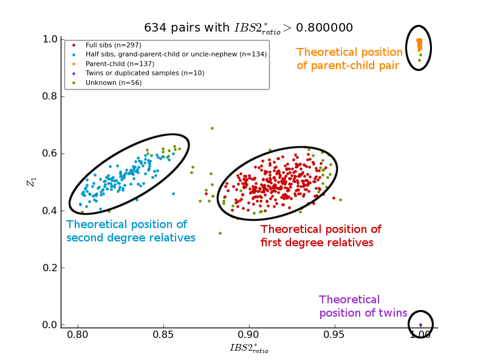

.. _related_samples_label:

Related Samples Module
======================

The usage of the standalone module is shown below:

.. code-block:: console

    $ pyGenClean_find_related_samples --help
    usage: pyGenClean_find_related_samples [-h] [-v] --bfile FILE [--genome-only]
                                           [--min-nb-snp INT]
                                           [--indep-pairwise STR STR STR]
                                           [--maf FLOAT] [--ibs2-ratio FLOAT]
                                           [--sge] [--sge-walltime TIME]
                                           [--sge-nodes INT INT]
                                           [--line-per-file-for-sge INT]
                                           [--out FILE]

    Finds related samples according to IBS values.

    optional arguments:
      -h, --help            show this help message and exit
      -v, --version         show program's version number and exit

    Input File:
      --bfile FILE          The input file prefix (will find the plink binary
                            files by appending the prefix to the .bim, .bed and
                            .fam files, respectively.)

    Options:
      --genome-only         Only create the genome file
      --min-nb-snp INT      The minimum number of markers needed to compute IBS
                            values. [Default: 10000]
      --indep-pairwise STR STR STR
                            Three numbers: window size, window shift and the r2
                            threshold. [default: ['50', '5', '0.1']]
      --maf FLOAT           Restrict to SNPs with MAF >= threshold. [default:
                            0.05]
      --ibs2-ratio FLOAT    The initial IBS2* ratio (the minimum value to show in
                            the plot. [default: 0.8]
      --sge                 Use SGE for parallelization.
      --sge-walltime TIME   The walltime for the job to run on the cluster. Do not
                            use if you are not required to specify a walltime for
                            your jobs on your cluster (e.g. 'qsub
                            -lwalltime=1:0:0' on the cluster).
      --sge-nodes INT INT   The number of nodes and the number of processor per
                            nodes to use (e.g. 'qsub -lnodes=X:ppn=Y' on the
                            cluster, where X is the number of nodes and Y is the
                            number of processor to use. Do not use if you are not
                            required to specify the number of nodes for your jobs
                            on the cluster.
      --line-per-file-for-sge INT
                            The number of line per file for SGE task array.
                            [default: 100]

    Output File:
      --out FILE            The prefix of the output files. [default: ibs]

Input Files
-----------

This module uses PLINK's binary file format (``bed``, ``bim`` and ``fam`` files)
for the source data set (the data of interest).

Procedure
---------

Here are the steps performed by the module:

1.  Uses Plink to extract markers according to LD.
2.  Checks if there is enough markers after pruning.
3.  Extract markers according to LD.
4.  Runs Plink with the ``genome`` option to compute the IBS values.
5.  Finds related individuals and gets values for plotting.
6.  Plots ``Z1`` in function of ``IBS2 ratio`` for related individuals.
7.  Plots ``Z2`` in function of ``IBS2 ratio`` for related individuals.

Output Files
------------

The output files of each of the steps described above are as follow (note that
the output prefix shown is the one by default [*i.e.* ``ibs``]):

1.  One set of PLINK's result files:

    *   ``ibs.pruning_0.1``: the results of the pruning process of Plink. The
        value depends on the option of ``--indep-pairwise``. The markers that
        are kept are in the file ``ibs.pruning_0.1.prune.in``.

2.  No file created.
3.  One set of PLINK's binary files:

    *   ``ibs.pruned_data``: the data sets containing only the marker from the
        first step (the list is in ``ibs.pruning_0.1.prune.in``).

4.  One set of PLINK's result files (two if ``--sge`` is used):

    *   ``ibs.frequency``: PLINK's result files when computing the frequency of
        each of the pruned markers. This data set will exist only if the option
        ``--sge`` is used.
    *   ``ibs.genome``: PLINK's results including IBS values.

5.  One file provided by the :py:mod:`pyGenClean.RelatedSamples.find_related_samples` and
    three files provided by :py:mod:`pyGenClean.RelatedSamples.merge_related_samples`:

    * ``ibs.related_individuals``: a subset of the ``ibs.genome.genome`` file
        containing only samples that are considered to be related. Three columns
        are appended to the original ``ibs.genome.genome`` file: ``IBS2_ratio``
        (the value that is considered to find related individuals), ``status``
        (the type of relatedness [*e.g.* twins]) and ``code`` (a numerical code
        that represent the ``status``). This file is provided by the
        :py:mod:`pyGenClean.RelatedSamples.find_related_samples` module.
    *   ``ibs.merged_related_individuals``: a file aggregating related samples
        in groups, containing the following columns: ``index`` (the group
        number), ``FID1`` (the family ID of the first sample), ``IID1`` (the
        individual ID of the first sample), ``FID2`` (the family ID of the
        second sample), ``IID2`` (the individual ID of the second sample) and
        ``status`` (the type of relatedness between the two samples). This file
        is provided by the :py:mod:`merge_related_samples`.
    *   ``ibs.chosen_related_individuals``: the related individuals that were
        randomly chosen from each group to be kept in the final data set. This
        file is provided by the :py:mod:`merge_related_samples`.
    *   ``ibs.discarded_related_individual``: the related individuals that needs
        to be discarded, so that the final data set include only unrelated
        individuals. This file is provided by the
        :py:mod:`merge_related_samples`.

6.  One image file:

    *   ``ibs.related_individuals_z1.png``: a plot showing the :math:`Z_1` value
        in function of the :math:`IBS2^*_{ratio}` for all samples above a
        certain :math:`IBS2^*_{ratio}` (the default threshold is 0.8). See
        Figure :ref:`ibs_z1_figure`.

7.  One image file:

    *   ``ibs.related_individuals_z2.png``: a plot showing the :math:`Z_2` value
        in function of the :math:`IBS2^*_{ratio}` for all samples above a
        certain :math:`IBS2^*_{ratio}` (the default threshold is 0.8). See
        Figure :ref:`ibs_z2_figure`.

The Plots
---------

The first plot (:ref:`ibs_z1_figure` figure) that is created is :math:`Z_1` in
function of :math:`IBS2^*_{ratio}` (where each point represents a pair of
related individuals. The color code comes from the different value of
:math:`Z_0`, :math:`Z_1` and :math:`Z_2`, as described in the
:py:func:`pyGenClean.RelatedSamples.find_related_samples.extractRelatedIndividuals`
function. In this plot, there are four locations where related samples tend to
accumulate (first degree relatives (full sibs), second degree relatives
(half-sibs, grand-parent-child or uncle-nephew), parent-child and twins (or
duplicated samples). The unknown sample pairs represent possible undetected
related individuals.

.. _ibs_z1_figure:

    Z1 in function of IBS2 ratio

The second plot (:ref:`ibs_z2_figure` figure) that is created is :math:`Z_2` in
function of :math:`IBS2^*_{ratio}` (where each point represents a pair of
related individuals. It's just another representation of relatedness of sample
pairs, where the location of the "clusters" is different.

.. _ibs_z2_figure:

.. figure:: _static/images/find_related_samples/ibs_related_individuals_z2.png
    :align: center
    :width: 50%
    :alt: Z2 in function of IBS2 ratio

    Z2 in function of IBS2 ratio

Finding Outliers
----------------

A standalone script was created in order to regroup related samples in
different subset. The usage is as follow:

.. code-block:: console

    $ pyGenClean_merge_related_samples --help
    usage: pyGenClean_merge_related_samples [-h] [-v] --ibs-related FILE
                                            [--no-status] [--out FILE]

    Merges related samples according to IBS.

    optional arguments:
      -h, --help          show this help message and exit
      -v, --version       show program's version number and exit

    Input File:
      --ibs-related FILE  The input file containing related individuals according
                          to IBS value.

    Options:
      --no-status         The input file doesn't have a 'status' column.

    Output File:
      --out FILE          The prefix of the output files. [default: ibs_merged]

At the end of the analysis, two files are created. The file
``*.chosen_related_individuals"`` contains a list of randomly selected samples
according to their relatedness (to keep only on sample for a group of related
samples). The file ``*.discarded_related_individuals`` contains a list of
sample to exclude to only keep unrelated samples in a dataset.

The Algorithm
-------------

For more information about the actual algorithms and source codes (the
:py:mod:`pyGenClean.RelatedSamples.find_related_samples` and
:py:mod:`pyGenClean.RelatedSamples.merge_related_samples` modules), refer to
the following sections.

pyGenClean.RelatedSamples.find_related_samples
..............................................

.. automodule:: pyGenClean.RelatedSamples.find_related_samples
    :members:

pyGenClean.RelatedSamples.merge_related_samples
...............................................

.. automodule:: pyGenClean.RelatedSamples.merge_related_samples
    :members:
