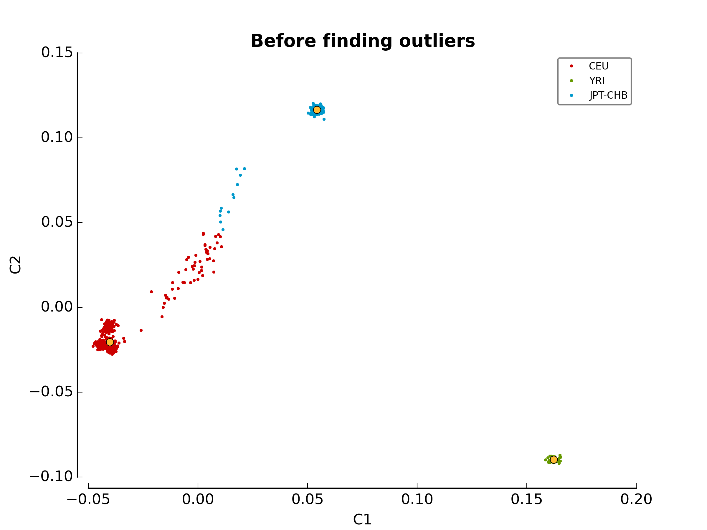
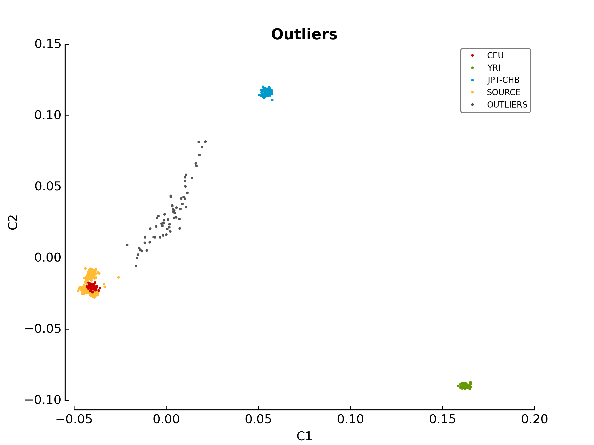

Linux Installation
******************

The following steps will help you install :py:mod:`pyGenClean` on a Linux
machine.

Requirements
============

The following softwares and packages are required for :py:mod:`pyGenClean`:

1.  Python 2.7
2.  PLINK (1.07)
3.  ``numpy`` (version 1.6.2 or latest)
4.  ``matplotlib`` (version 1.2.0 or latest)
5.  ``scipy`` (version 0.11.0 or latest)
6.  ``scikit-learn`` (version 0.12.1 or latest)
7.  ``Jinja2`` (version 2.7.3 or latest)

.. note::

   All the requirements will be installed along with the main
   :py:mod:`pyGenClean` module.

.. warning::

   The `Plink` software needs to be in the `PATH` (or in the current working
   directory). In other words, you should be able to type `plink` at the
   command line.

Installation
============

There are two main ways to to install :py:mod:`pyGenClean`: using an existing
Python 2.7 distribution and creating a Python
:ref:`python_virtual_environment_label`, or using :ref:`python_miniconda`.

.. _python_virtual_environment_label:

Virtual environment
-------------------

If python is already installed, a python virtual environment should be created.
If one is already present, you can just proceed to the
:ref:`activate_virtual_environment_label` section.

To create a new python virtual environment, download the latest version of
``virtualenv``, located at this web page:
`http://pypi.python.org/pypi/virtualenv
<http://pypi.python.org/pypi/virtualenv>`_. At the moment of writing this
documentation, the latest version was 13.1.2, and the file was named
``virtualenv-13.1.2.tar.gz``. Locate the archive, which is usually in the
``~/Downloads`` directory.

.. code-block:: console

    $ cd ~/Downloads
    $ tar -zxf virtualenv-13.1.2.tar.gz
    $ cd virtualenv-13.1.2

There is no need to install the module. Just create a directory  and create the
Python virtual environment:

.. code-block:: console

    $ mkdir -p ~/softwares/Python-2.7_virtualenv
    $ python ./virtualenv.py \
    >     --no-site-packages \
    >     ~/softwares/Python-2.7_virtualenv

.. _activate_virtual_environment_label:

Activating the environment
^^^^^^^^^^^^^^^^^^^^^^^^^^

To activate the Python virtual environment, perform the following command:

.. code-block::  console

    $ source ~/softwares/Python-2.7_virtualenv/bin/activate

Finally, to deactivate the Python virtual environment, either close the
terminal, or perform the following command:

.. code-block:: console

    $ deactivate

.. warning::

    For the following installations and tests, be certain that the Python
    virtual environment is activated, or nothing will work as planned...

    The best way to know if the Python virtual environment is activated, is to
    see its name, in parenthesis, before the usual prompt in the terminal. For
    example:

    .. code-block:: none

        (Python-2.7_virtualenv)[username@localhost ~]$

Installing pyGenClean
^^^^^^^^^^^^^^^^^^^^^

To install :py:mod:`pyGenClean`, only perform the following command:

.. code-block:: console

   $ pip install pyGenClean

Updating pyGenClean
^^^^^^^^^^^^^^^^^^^

To update :py:mod:`pyGenClean`, perform the following command:

.. code-block:: console

   $ pip install -U pyGenClean

.. _python_miniconda:

Miniconda
---------

Download miniconda (located at `http://conda.pydata.org/miniconda.html
<http://conda.pydata.org/miniconda.html>`_). By default, miniconda is installed
in  ``~/miniconda``.

To create a new virtual environment, perform the following command:

.. code-block:: console

   $ conda create -n Python-2.7_virtualenv python=2

.. _activate_conda_virtual_environment_label:

Activating the conda environment
^^^^^^^^^^^^^^^^^^^^^^^^^^^^^^^^

To activate the Python virtual environment (miniconda), perform the following
command:

.. code-block::  console

    $ source ~/miniconda/bin/activate Python-2.7_virtualenv

Finally, to deactivate the Python virtual environment, either close the
terminal, or perform the following command:

.. code-block:: console

    $ source deactivate

.. warning::

    For the following installations and tests, be certain that the Python
    virtual environment is activated, or nothing will work as planned...

    The best way to know if the Python virtual environment is activated, is to
    see its name, in parenthesis, before the usual prompt in the terminal. For
    example:

    .. code-block:: none

        (Python-2.7_virtualenv)[username@localhost ~]$

Installing pyGenClean
^^^^^^^^^^^^^^^^^^^^^

To install :py:mod:`pyGenClean`, only perform the following command:

.. code-block:: console

   $ conda install pyGenClean -c http://statgen.org/wp-content/uploads/Softwares/pyGenClean

Updating pyGenClean
^^^^^^^^^^^^^^^^^^^

To update :py:mod:`pyGenClean`, perform the following command:

.. code-block:: console

   $ conda update pyGenClean -c http://statgen.org/wp-content/uploads/Softwares/pyGenClean

.. _testing_label:

Testing the installation
========================

.. warning::

    Before using *pyGenClean*, be certain that the previously installed Python
    virtual environment is activated (see
    :ref:`activate_virtual_environment_label` or
    :ref:`activate_conda_virtual_environment_label` for more information). If
    the proper environment is not activated, noting will work...

To test the algorithm, download the test data from
`http://statgen.org/downloads/pygenclean/
<http://statgen.org/downloads/pygenclean/>`_ and the HapMap reference
populations (build 37).

Locate the downloaded archives (it should be in the ``~/Downloads`` directory).
Perform the following commands:

.. code-block:: console

    $ cd ~/Downloads
    $ mkdir -p ~/test_pyGenClean
    $ tar -C ~/test_pyGenClean -jxf check_ethnicity_HapMap_reference_populations_b37.tar.bz2
    $ tar -C ~/test_pyGenClean -jxf pyGenClean_test_data.tar.bz2
    $ cd ~/test_pyGenClean

Create a text file named ``conf.ini`` inside the ``~/test_pyGenClean``
directory, containing the following text:

.. code-block:: lighttpd
    :linenos:

    [1]
    script = check_ethnicity
    ceu-bfile = check_ethnicity_HapMap_ref_pops_b37/hapmap_CEU_r23a_filtered_b37
    yri-bfile = check_ethnicity_HapMap_ref_pops_b37/hapmap_YRI_r23a_filtered_b37
    jpt-chb-bfile = check_ethnicity_HapMap_ref_pops_b37/hapmap_JPT_CHB_r23a_filtered_b37
    nb-components = 2
    multiplier = 1

    [2]
    script = sex_check

Run the following command:

.. code-block:: console

    $ run_pyGenClean \
    >     --conf conf.ini \
    >     --bfile pyGenClean_test_data/1000G_EUR-MXL_Human610-Quad-v1_H

Results
-------

Valuable information will be shown in the terminal. Once the program has
finished, the results are in the new directory ``data_clean_up.date_time``
where ``date`` is the current date, and ``time`` is the time at which the
analysis started.

Here are the new directory structure, with only the files you might be
interested in:

*   ``data_clean_up.date_time/``

    * ``pyGenClean.log``

    * ``automatic_report.tex``

    * ``excluded_markers.txt``

    * ``excluded_samples.txt``

    *   ``1_check_ethnicity/``

        *   ``ethnicity.before.png``
        *   ``ethnicity.outliers.png``
        *   ``ethnicity.outliers``
        *   ``ethnicity.population_file_outliers``

    *   ``2_sex_check/``

        *   ``sexcheck.list_problem_sex``

The file ``pyGenClean.log`` contain the information that was displayed in the
console. The file ``automatic_report.txt`` contain the automatic report
generated by :py:mod:`pyGenClean`. The files ``excluded_markers.txt`` and
``excluded_samples.txt`` contains the list of markers and samples,
respectively, that were excluded from the dataset (with the reason).

1_check_ethnicity/
^^^^^^^^^^^^^^^^^^

The first image in the first directory
(:ref:`test_ethnicity_before_linux_figure`) shows the MDS values for each
sample before outlier detection. The second image
(:ref:`test_ethnicity_outliers_linux_figure`) shows the outliers that should be
removed for further analysis. Finally, the file ``ethnicity.outliers`` include
a list of samples that should be removed for further analysis. **The total
number of outliers for this test should be exactly 63**, but the figures might
be mirrored for 32 bits systems. For more information about the results of this
module, refer to Section :ref:`ethnicity_module_label`.

.. _test_ethnicity_before_linux_figure:

    ethnicity.before.png

.. _test_ethnicity_outliers_linux_figure:

    ethnicity.outliers.png

2_sex_check/
^^^^^^^^^^^^

In the second directory, there should be a file containing the list of samples
with gender problem. **There should be exactly 4 samples with gender problem.**
For more information about this module, refer to Section
:ref:`sexcheck_module_lable`.

If you want to compare your results with the expected ones, just download the
files in the archive ``pyGenClean_expected_results.tar.bz2``, available through
`http://statgen.org/downloads/pygenclean/
<http://statgen.org/downloads/pygenclean/>`_. They were generated using Fedora
18 (64 bits) in about 20 minutes. You should at least compare the following
files:

*   ``1_check_ethnicity``

    *   ``ethnicity.outliers``
    *   ``ethnicity.population_file_outliers``
    *   All the figures (they might be mirrored).

*   ``2_sex_check``

    *   ``sexcheck.list_problem_sex``
    *   ``sexcheck.list_problem_sex_ids``

Automatic report
----------------

If LaTeX is installed, you can perform the following commands to compile the
automatic report into a PDF file.

.. code-block:: console

    $ pdflatex automatic_report.tex
    $ pdflatex automatic_report.tex
    $ pdflatex automatic_report.tex

The `following PDF report <_static/images/installation/automatic_report.pdf>`_
will be generated.
