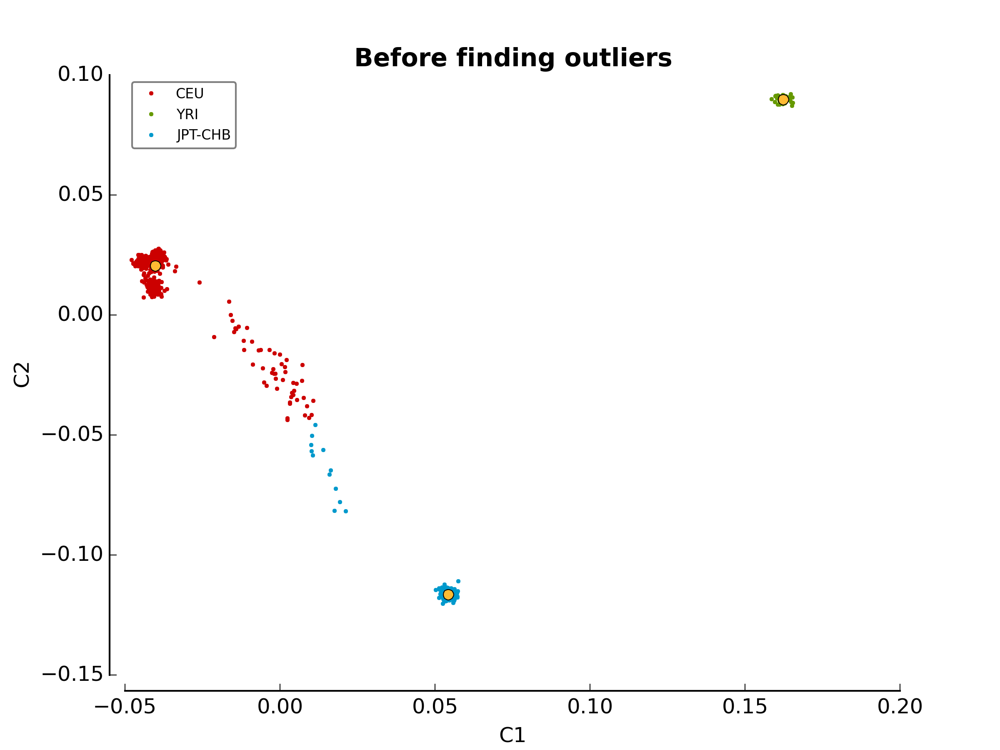
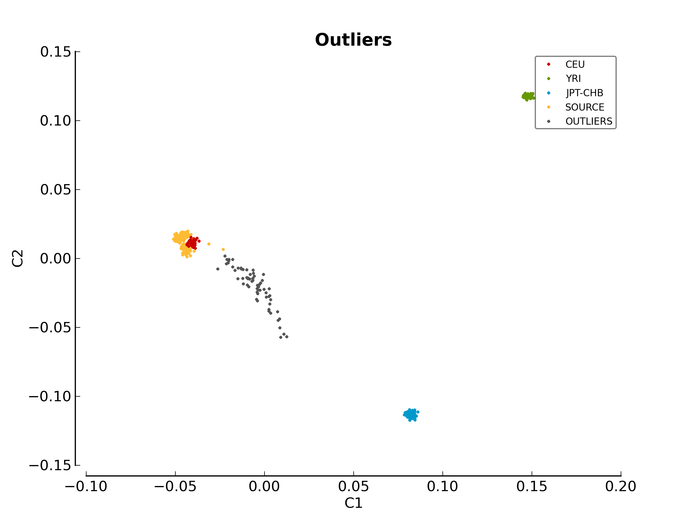

Windows Installation
********************

The following steps will help you install *pyGenClean* on a Windows machine. It
has been tested on both Windows XP and Windows 7.

Requirements
============

The following softwares and packages are required for :py:mod:`pyGenClean`:

1.  Python 2.7
2.  PLINK (1.07)
3.  ``numpy`` (version 1.6.2 or latest)
4.  ``matplotlib`` (version 1.2.0 or latest)
5.  ``scipy`` (version 0.11.0 or latest)
6.  ``scikit-learn`` (version 0.12.1 or latest)
7.  ``Jinja2`` (version 2.7.3 or latest)

.. note::

   All the requirements will be installed along with the main
   :py:mod:`pyGenClean` module.

.. warning::

   The `Plink` software needs to be in the `PATH` (or in the current working
   directory). In other words, you should be able to type `plink` at the
   command line.

Installation
============

The easiest way to install Python on windows is by using
:ref:`python_miniconda`.

.. _installation_python_win_label:

Miniconda
---------

Download miniconda (located at `http://conda.pydata.org/miniconda.html
<http://conda.pydata.org/miniconda.html>`_).

To create a new virtual environment, perform the following command:

.. code-block:: console

   $ conda create -n Python-2.7_virtualenv python=2

.. _activate_conda_virtual_environment_win_label:

Activating the conda environment
^^^^^^^^^^^^^^^^^^^^^^^^^^^^^^^^

To activate the Python virtual environment (miniconda), perform the following
command:

.. code-block::  console

    $ activate Python-2.7_virtualenv

Installing pyGenClean
^^^^^^^^^^^^^^^^^^^^^

To install :py:mod:`pyGenClean`, only perform the following command:

.. code-block:: console

   $ conda install pyGenClean -c http://statgen.org/wp-content/uploads/Softwares/pyGenClean

Updating pyGenClean
^^^^^^^^^^^^^^^^^^^

To update :py:mod:`pyGenClean`, perform the following command:

.. code-block:: console

   $ conda update pyGenClean -c http://statgen.org/wp-content/uploads/Softwares/pyGenClean

Testing the Algorithm
=====================

To test the algorithm, download the test data from
`http://statgen.org/downloads/pygenclean/
<http://statgen.org/downloads/pygenclean/>`_ and the HapMap reference
populations (build 37). Create a directory on your Desktop named
``pyGenClean_test``, and extract the two archive into it. You should have the
following directory structure:

.. code-block:: none

    Desktop\
        pyGenClean_test_data\
            1000G_EUR-MXL_Human610-Quad-v1_H.bed
            1000G_EUR-MXL_Human610-Quad-v1_H.bim
            1000G_EUR-MXL_Human610-Quad-v1_H.fam
        check_ethnicity_HapMap_ref_pops_b37\
            hapmap_CEU_r23a_filtered_b37.bed
            hapmap_CEU_r23a_filtered_b37.bim
            hapmap_CEU_r23a_filtered_b37.fam
            hapmap_YRI_r23a_filtered_b37.bed
            hapmap_YRI_r23a_filtered_b37.bim
            hapmap_YRI_r23a_filtered_b37.fam
            hapmap_JPT_CHB_r23a_filtered_b37.bed
            hapmap_JPT_CHB_r23a_filtered_b37.bim
            hapmap_JPT_CHB_r23a_filtered_b37.fam

Open the command prompt and navigate to the newly created directory, and
created an new text file using ``notepad``:

.. code-block:: none

    > cd Desktop\pyGenClean_test
    > notepad conf.ini

Insert the following code in the file:

.. code-block:: lighttpd
    :linenos:

    [1]
    script = check_ethnicity
    ceu-bfile = check_ethnicity_HapMap_ref_pops_b37/hapmap_CEU_r23a_filtered_b37
    yri-bfile = check_ethnicity_HapMap_ref_pops_b37/hapmap_YRI_r23a_filtered_b37
    jpt-chb-bfile = check_ethnicity_HapMap_ref_pops_b37/hapmap_JPT_CHB_r23a_filtered_b37
    nb-components = 2
    multiplier = 1

    [2]
    script = sex_check

Finally, run the following command:

.. code-block:: none

    > run_pyGenClean ^
          --conf conf.ini ^
          --bfile pyGenClean_test_data\1000G_EUR-MXL_Human610-Quad-v1_H

Results
-------

Valuable information will be shown on the command prompt. Once the program has
finished, the results are in the new directory ``data_clean_up.date_time``
where ``date`` is the current date, and ``time`` is the time when the program
started.

Here are the new directory structure, with only the files you might be
interested in:

*   ``data_clean_up.data_time\``

    * ``pyGenClean.log``

    * ``automatic_report.tex``

    * ``excluded_markers.txt``

    * ``excluded_samples.txt``

    *   ``1_check_ethnicity\``

        *   ``ethnicity.before.png``
        *   ``ethnicity.outliers.png``
        *   ``ethnicity.outliers``
        *   ``ethnicity.population_file_outliers``

    *   ``2_sex_check\``

        *   ``sexcheck.list_problem_sex``

The file ``pyGenClean.log`` contain the information that was displayed in the
console. The file ``automatic_report.txt`` contain the automatic report
generated by :py:mod:`pyGenClean`. The files ``excluded_markers.txt`` and
``excluded_samples.txt`` contains the list of markers and samples,
respectively, that were excluded from the dataset (with the reason).

1_check_ethnicity/
^^^^^^^^^^^^^^^^^^

The first image in the first directory
(:ref:`test_ethnicity_before_win_figure`) shows the MDS values for each sample
before outlier detection. The second image
(:ref:`test_ethnicity_outliers_win_figure`) shows the outliers that should be
removed for further analysis. Finally, the file ``ethnicity.outliers`` include
a list of samples that should be removed for further analysis. **The total
number of outliers for this test should be exactly 63**. For more information
about the results of this module, refer to Section
:ref:`ethnicity_module_label`.

.. _test_ethnicity_before_win_figure:

    ethnicity.before.png

.. _test_ethnicity_outliers_win_figure:

    ethnicity.outliers.png

2_sex_check/
^^^^^^^^^^^^

In the second directory, there should be a file containing the list of samples
with gender problem. **There should be exactly 4 samples with gender problem.**
For more information about this module, refer to Section
:ref:`sexcheck_module_lable`.

If you want to compare your results with the expected ones, just download the
files in the archive ``pyGenClean_expected_results.tar.bz2``, available through
`http://statgen.org/downloads/pygenclean/
<http://statgen.org/downloads/pygenclean/>`_. They were generated using Fedora
18 (64 bits) in about 20 minutes. You should at least compare the following
files:

*   ``1_check_ethnicity``

    *   ``ethnicity.outliers``
    *   ``ethnicity.population_file_outliers``
    *   All the figures (they might be mirrored).

*   ``2_sex_check``

    *   ``sexcheck.list_problem_sex``
    *   ``sexcheck.list_problem_sex_ids``

Automatic report
----------------

If LaTeX is installed, you can perform the following commands to compile the
automatic report into a PDF file.

.. code-block:: console

    $ pdflatex automatic_report.tex
    $ pdflatex automatic_report.tex
    $ pdflatex automatic_report.tex

The `following PDF report <_static/images/installation/automatic_report.pdf>`_
will be generated.
