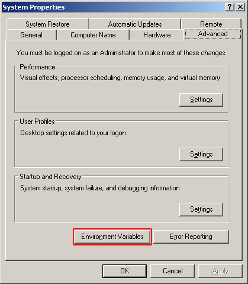
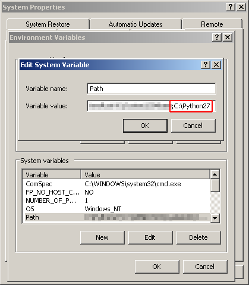

Windows Installation
====================

The following steps will help you install *pyGenClean* on a Windows machine. It
has been tested on both Windows XP and Windows 7.

Prerequisites
-------------

The following softwares and packages are required for *pyGenClean*:

1.  Python 2.7 (32 bits)
2.  NumPy (:math:`\geq` 1.6.2)
3.  matplotlib (:math:`\geq` 1.2.0)
4.  scipy (:math:`\geq` 0.11.0).
5.  scikit-learn (:math:`\geq` 0.12.1)
6.  PLINK (1.07)

Installation
------------

.. _installation_python_win_label:

Python
......

On the Python download page (available at `http://python.org/download/
<http://python.org/download/>`_), download the latest version of Python 2.7
Windows Installer (**do not choose** the Windows X86-64 or any Python 3
installer). At the moment of writing this documentation, the latest version was
2.7.3.

Locate the downloaded installer, and install it for all users using the default
options. The directory ``C:\Python27`` should now be created.

Edit the ``Path`` variable to include the ``C:\Python27`` path. To do so, right
click on ``My Computer > Properties`` on the Desktop (Windows XP users), or
right click on ``Computer > Properties`` in the start menu and on ``Advanced
system parameters`` (Windows 7 users). In the ``Advanced`` tab, click on the
``Environment variables`` button (see figure :ref:`system_properties_figure`).

.. _system_properties_figure:

    System Properties

Edit the ``Path`` variable (by selecting it and clicking on ``Edit``, and add
the following text at the end of the line: ``;C:\Python27`` (**do not forget**
the ``;``) (see figure :ref:`edit_system_variable_figure`).

.. _edit_system_variable_figure:

    Edit System Variable

To test the installation, click on ``Run...`` in the start menu and type ``cmd``
(Windows XP users), or search for ``cmd`` in the search bar of the start menu
(Windows 7 users). In the prompt, type ``python``, and you should get the
following result:

.. code-block:: none

    > python
    Python 2.7.3 (default, Apr 10 2012, 23:31:26) [MSC v.1500 32 bit (Intel)] on win32
    Type "help", "copyright", "credits" or "license" for more information.
    >>>

Type ``exit()`` to close Python, and ``exit`` to close the command prompt.

NumPy
.....

On the NumPy download page (available at
`http://sourceforge.net/projects/numpy/files/
<http://sourceforge.net/projects/numpy/files/>`_), download the latest version
of Numpy (which is **not** a release candidate) by selecting the correct build
(NumPy for Python 2.7 on win32). At the moment of writing this documentation,
the latest version was 1.7.0, and the file was named
``numpy-1.7.0-win32-superpack-python2.7.exe``. Do not install any beta (with a
``b`` in the file name) or release candidate (with a ``rc`` in the file name)
version.

Locate the downloaded installer, and install it for all users using the default
options. It should locate and install in the ``C:\Python27`` directory.

matplotlib
..........

On the matplotlib download page (available at
`http://matplotlib.org/downloads.html <http://matplotlib.org/downloads.html>`_),
download the latest version of matplotlib by selecting the correct build
(matplotlib for Python 2.7 on win32). At the moment of writing this
documentation, the latest version was 1.2.0, and the file was named
``matplotlib-1.2.0.win32-py2.7.exe``. Do not install any beta (with a ``b`` in
the file name) or release candidate (with a ``rc`` in the file name) version.

Locate the downloaded installer, and install it for all users using the default
options. It should locate and install in the ``C:\Python27`` directory.

scipy
.....

On the scipy download page (available at
`http://sourceforge.net/projects/scipy/files/
<http://sourceforge.net/projects/scipy/files/>`_), download the latest version
of scipy (which is **not** a release candidate) by selecting the correct build
(scipy for Python 2.7 on win32). At the moment of writing this documentation,
the latest version was 0.11.0, and the file was named
``scipy-0.11.0-win32-superpack-python2.7.exe``. Do not install any beta (with a
``b`` in the file name) or release candidate (with a ``rc`` in the file name)
version.

Locate the downloaded installer, and install it for all users using the default
options. It should locate and install in the ``C:\Python27`` directory.

scikit-learn
............

On the scikit-learn download page (available at
`http://sourceforge.net/projects/scikit-learn/files/
<http://sourceforge.net/projects/scikit-learn/files/>`_), download the latest
version of scikit-learn by selecting the correct build (scikit-learn for Python
2.7 on win32). At the moment of writing this documentation, the latest version
was 0.13, and the file was named ``scikit-learn-0.13.win32-py2.7.exe``. Do not
install any beta (with a ``b`` in the file name) or release candidate (with a
``rc`` in the file name) version.

Locate the downloaded installer, and install it for all users using the default
options. It should locate and install in the ``C:\Python27`` directory.

PLINK
.....

On the PLINK download page (available at
`http://pngu.mgh.harvard.edu/~purcell/plink/download.shtml
<http://pngu.mgh.harvard.edu/~purcell/plink/download.shtml>`_), download the
latest version of PLINK for MS-DOS. At the moment of writing this documentation,
the latest version was 1.07.

Locate the downloaded archive, and extract it directly in the ``C:`` directory.
The name of the directory should be ``C:\plink-1.07-dos``.

Edit the ``Path`` variable to include the ``C:\plink-1.07-dos`` path. Edit the
``Path`` variable by adding the following text at the end of the line:
``;C:\plink-1.07-dos`` (**do not forget** the ``;``). For more information,
refer to the :ref:`installation_python_win_label` installation section.

To test the installation, click on ``Run...`` in the start menu and type ``cmd``
(Windows XP users), or search for ``cmd`` in the search bar of the start menu
(Windows 7 users). In the prompt, type ``plink``, and you should get the
following result:

.. code-block:: none

    > plink
    @----------------------------------------------------------@
    |        PLINK!       |     v1.07      |   10/Aug/2009     |
    |----------------------------------------------------------|
    |  (C) 2009 Shaun Purcell, GNU General Public License, v2  |
    |----------------------------------------------------------|
    |  For documentation, citation & bug-report instructions:  |
    |        http://pngu.mgh.harvard.edu/purcell/plink/        |
    @----------------------------------------------------------@
    
    Web-based version check ( --noweb to skip )
    Connecting to web...  OK, v1.07 is current
    
    Writing this text to log file [ plink.log ]
    Analysis started: Fri Feb 15 13:34:55 2013
    
    Options in effect:
    
    Before frequency and genotyping pruning, there are 0 SNPs
    0 founders and 0 non-founders found
    0 SNPs failed missingness test ( GENO > 1 )
    0 SNPs failed frequency test ( MAF < 0 )
    After frequency and genotyping pruning, there are 0 SNPs
    
    ERROR: Stopping as there are no SNPs left for analysis

Type ``exit`` to close the command prompt.

pyGenClean
..........

Just download the Windows installer, and install the software.

Testing the Algorithm
---------------------

To test the algorithm, download the test data from `http://www.statgen.org
<http://www.statgen.org>`_ and the HapMap reference populations (build 37).
Create a directory on your Desktop named ``pyGenClean_test``, and extract the
two archive into it. You should have the following directory structure:

.. code-block:: none

    Desktop\
        pyGenClean_test_data\
            1000G_EUR-MXL_Human610-Quad-v1_H.bed
            1000G_EUR-MXL_Human610-Quad-v1_H.bim
            1000G_EUR-MXL_Human610-Quad-v1_H.fam
        check_ethnicity_HapMap_ref_pops_b37\
            hapmap_CEU_r23a_filtered_b37.bed
            hapmap_CEU_r23a_filtered_b37.bim
            hapmap_CEU_r23a_filtered_b37.fam
            hapmap_YRI_r23a_filtered_b37.bed
            hapmap_YRI_r23a_filtered_b37.bim
            hapmap_YRI_r23a_filtered_b37.fam
            hapmap_JPT_CHB_r23a_filtered_b37.bed
            hapmap_JPT_CHB_r23a_filtered_b37.bim
            hapmap_JPT_CHB_r23a_filtered_b37.fam

Open the command prompt (see section :ref:`installation_python_win_label` for
more information), and navigate to the newly created directory, and created an
new text file using ``notepad``:

.. code-block:: none

    > cd Desktop\pyGenClean_test
    > notepad conf.txt

Insert the following code in the file:

.. code-block:: lighttpd
    :linenos:

    [1]
    script = check_ethnicity
    ceu-bfile = check_ethnicity_HapMap_ref_pops_b37/hapmap_CEU_r23a_filtered_b37
    yri-bfile = check_ethnicity_HapMap_ref_pops_b37/hapmap_YRI_r23a_filtered_b37
    jpt-chb-bfile = check_ethnicity_HapMap_ref_pops_b37/hapmap_JPT_CHB_r23a_filtered_b37
    nb-components = 2
    multiplier = 1

    [2]
    script = sex_check

Finally, run the following command:

.. code-block:: none

    > python C:\Python27\Scripts\run_pyGenClean ^
          --conf conf.txt ^
          --bfile pyGenClean_test_data\1000G_EUR-MXL_Human610-Quad-v1_H

Valuable information will be shown on the command prompt. Once the program has
finished, the results are in the new directory ``data_clean_up.date_time`` where
``date`` is the current date, and ``time`` is the time when the program started.

Here are the new directory structure, with only the files you might be
interested in:

*   ``data_clean_up.data_time\``

    *   ``1_check_ethnicity\``

        *   ``ethnicity.before.png``
        *   ``ethnicity.outliers.png``
        *   ``ethnicity.outliers``
        *   ``ethnicity.population_file_outliers``

    *   ``2_sex_check\``

        *   ``sexcheck.list_problem_sex``

The first image in the first directory (:ref:`test_ethnicity_before_win_figure`)
shows the MDS values for each sample before outlier detection. The second image
(:ref:`test_ethnicity_outliers_win_figure`) shows the outliers that should be
removed for further analysis. Finally, the file ``ethnicity.outliers`` include a
list of samples that should be removed for further analysis. **The total number
of outliers for this test should be exactly 62**. For more information about the
results of this module, refer to Section :ref:`ethnicity_module_label`.

.. _test_ethnicity_before_win_figure:

.. figure:: _static/images/installation/ethnicity_before.png
    :align: center
    :width: 50%
    :alt: Ethnic Before Outliers

    ethnicity.before.png

.. _test_ethnicity_outliers_win_figure:

.. figure:: _static/images/installation/ethnicity_outliers.png
    :align: center
    :width: 50%
    :alt: Ethnic After Outliers

    ethnicity.outliers.png

In the second directory, there should be a file containing the list of samples
with gender problem. **There should be exactly 4 samples with gender problem.**
For more information about this module, refer to Section
:ref:`sexcheck_module_lable`.

If you want to compare your results with the expected ones, just download the
files in the archive ``pyGenClean_expected_results.tar.bz2``, available through
`http://www.statgen.org <http://www.statgen.org>`_. They were generated using
Fedora 18 (64 bits) in about 20 minutes. You should at least compare the
following files:

*   ``1_check_ethnicity``

    *   ``ethnicity.outliers``
    *   ``ethnicity.population_file_outliers``
    *   All the figures (they might be mirrored).

*   ``2_sex_check``

    *   ``sexcheck.list_problem_sex``
    *   ``sexcheck.list_problem_sex_ids``
