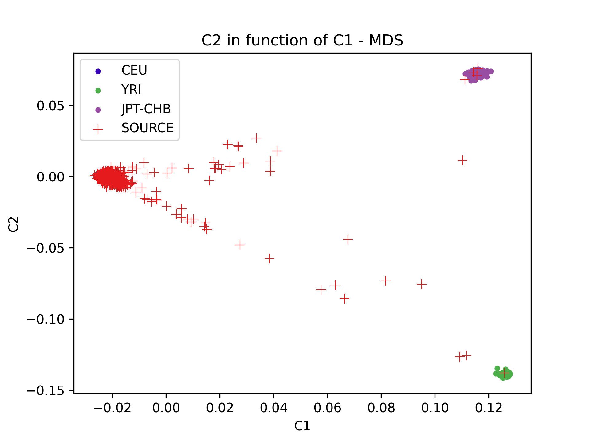
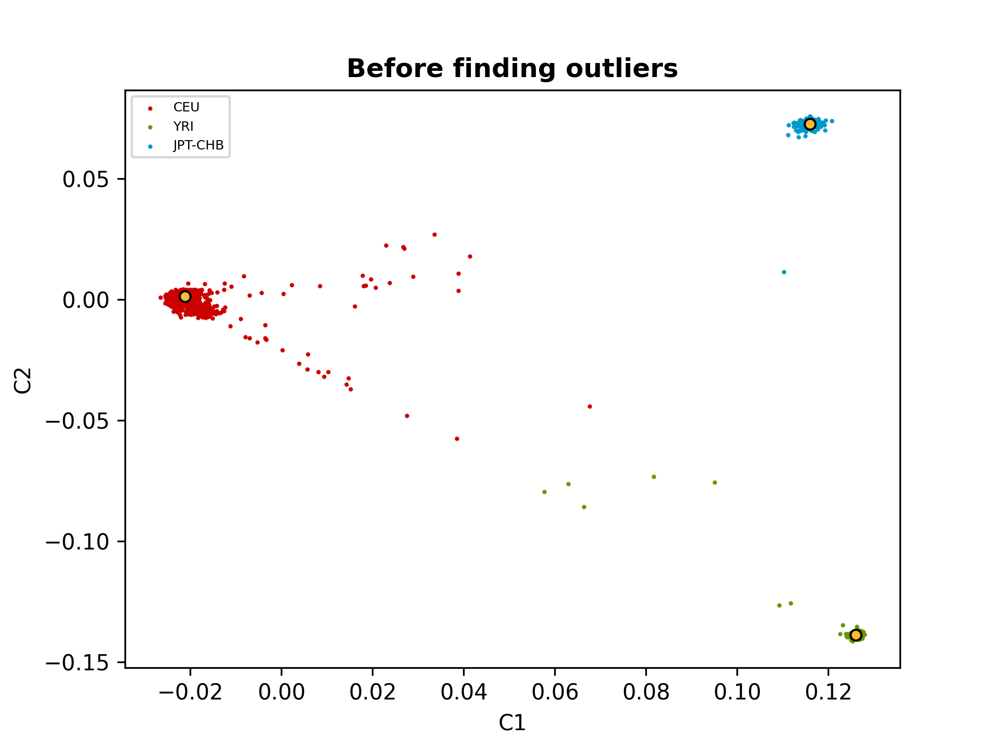
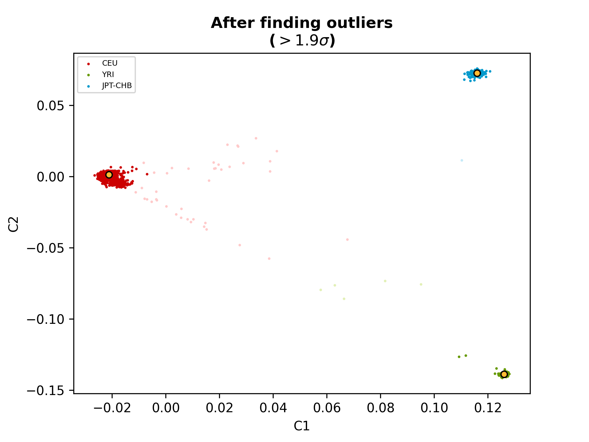
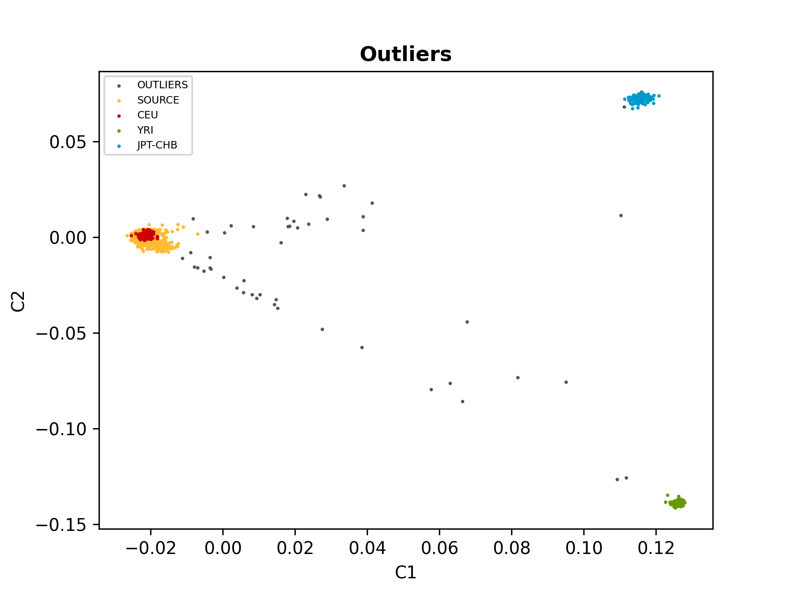
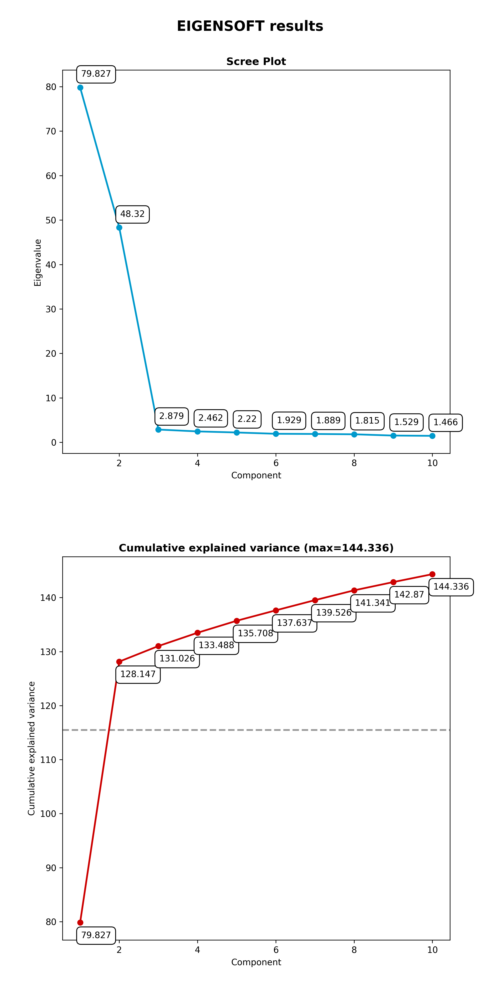
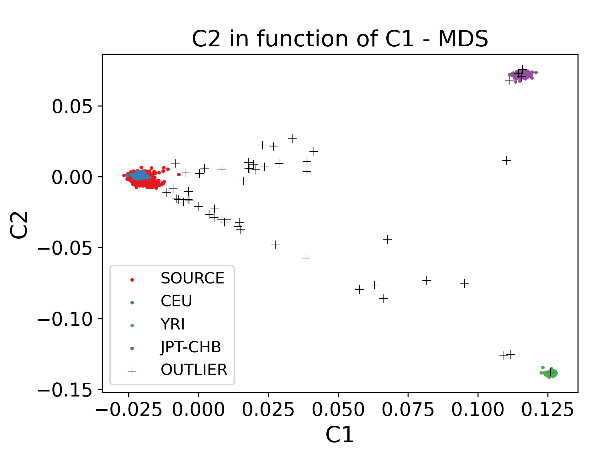

# Ancestry

The _ancestry_ QC module consists of a [main script](#main-script) and three
[companion scripts](#submodules).  It performs an MDS analysis using _Plink_
(with or without reference populations) and generates multiple ancestry plots.

Use the following command to access the multiple scripts of the _ancestry_ QC
module.

```shell-session
$ pyGenClean ancestry --help
usage: pyGenClean ancestry [-h] [-v]
                           {run,find-outliers,plot-mds,plot-eigenvalues} ...

Checks sample's ancestry using reference populations.

options:
  -h, --help            show this help message and exit
  -v, --version         show program's version number and exit

subcommands:
  Below is a list of tools in the ancestry module. Note that 'run' executes
  the main ancestry pipeline.

  {run,find-outliers,plot-mds,plot-eigenvalues}
    run                 Checks sample's ancestry using reference populations.
    find-outliers       Finds outliers in SOURCE from CEU samples.
    plot-mds            Create an MDS plot.
    plot-eigenvalues    Plot eigenvalues (scree plot).
```

## Main script

The main script (accessed using the `run` subcommand) performs an MDS analysis
of the source dataset (with or without reference populations).

```shell-session
$ pyGenClean ancestry run --help
usage: pyGenClean ancestry run [-h] --bfile FILE [--skip-ref-pops]
                               [--ceu-bfile FILE] [--yri-bfile FILE]
                               [--jpt-chb-bfile FILE] [--plink-1.07]
                               [--nb-threads N] [--min-nb-snp INT]
                               [--indep-pairwise STR STR STR] [--maf FLOAT]
                               [--nb-components INT]
                               [--find-outliers-format FORMAT]
                               [--outliers-of POP] [--multiplier FLOAT]
                               [--find-outliers-xaxis COMPONENT]
                               [--find-outliers-yaxis COMPONENT]
                               [--plot-mds-format FORMAT]
                               [--plot-mds-title STRING]
                               [--plot-mds-xaxis STRING]
                               [--plot-mds-yaxis STRING] [--create-scree-plot]
                               [--plot-eigen-title TITLE] [--out FILE]

Checks sample's ancestry using reference populations.

options:
  -h, --help            show this help message and exit

Input File:
  --bfile FILE          The input file prefix (will find the plink binary
                        files by appending the prefix to the .bim, .bed and
                        .fam files, respectively.
  --skip-ref-pops       Perform the MDS computation, but skip the three
                        reference panels.
  --ceu-bfile FILE      The input file prefix (will find the plink binary
                        files by appending the prefix to the .bim, .bed and
                        .fam files, respectively) for the CEU population
  --yri-bfile FILE      The input file prefix (will find the plink binary
                        files by appending the prefix to the .bim, .bed and
                        .fam files, respectively) for the YRI population
  --jpt-chb-bfile FILE  The input file prefix (will find the plink binary
                        files by appending the prefix to the .bim, .bed and
                        .fam files, respectively) for the JPT-CHB population

Options:
  --plink-1.07          Use original Plink (version 1.07)
  --nb-threads N        The number of threads for this analysis (no effect
                        when using plink 1.07). [1]
  --min-nb-snp INT      The minimum number of markers needed to compute IBS
                        values. [Default: 8000]
  --indep-pairwise STR STR STR
                        Three numbers: window size, window shift and the r2
                        threshold. [default: ['50', '5', '0.1']]
  --maf FLOAT           Restrict to SNPs with MAF >= threshold. [default:
                        0.05]
  --nb-components INT   The number of component to compute. [default: 10]

Outlier Options:
  --find-outliers-format FORMAT
                        The output file format (png, ps, or pdf formats are
                        available). [default: png]
  --outliers-of POP     Finds the outliers of this population. [default: CEU]
  --multiplier FLOAT    To find the outliers, we look for more than x times
                        the cluster standard deviation. [default: 1.9]
  --find-outliers-xaxis COMPONENT
                        The component to use for the X axis. [default: C1]
  --find-outliers-yaxis COMPONENT
                        The component to use for the Y axis. [default: C2]

MDS Plot Options:
  --plot-mds-format FORMAT
                        The output file format (png, ps, pdf, or X11 formats
                        are available). [default: png]
  --plot-mds-title STRING
                        The title of the MDS plot. [default: C2 in function of
                        C1 - MDS]
  --plot-mds-xaxis STRING
                        The component to use for the X axis. [default: C1]
  --plot-mds-yaxis STRING
                        The component to use for the Y axis. [default: C2]

Scree Plot Options:
  --create-scree-plot   Computes Eigenvalues and creates a scree plot.
  --plot-eigen-title TITLE
                        The main title of the scree plot [EIGENSOFT results]

Output File:
  --out FILE            The prefix of the output files. [default: ancestry]
```

### Input files

This module uses PLINK’s binary file format (`bed`, `bim` and `fam` files) for
the source data set (the data of interest) and, optionally, three sets of binary
files for the reference panels (_CEU_, _YRI_ and _JPG-CHB_).

### Procedure

1. Finds the overlapping markers between the three reference panels and
   the source panel.
2. Extract the required markers from all the data sets.
3. Renames the reference panel's marker names to that they are the same as
   the source panel (for all populations).
4. Combines the three reference panels together.
5. Compute the frequency of all the markers from the reference and the
   source panels.
6. Finds the markers to flip in the reference panel (when compared to the
   source panel).
7. Excludes the unflippable markers from the reference and the source
   panels.
8. Flips the markers that need flipping in their reference panel.
9. Combines the reference and the source panels.
10. Runs part of the related samples QC module on the combined data set to
    generate the `genome` file.
11. Creates the `mds` file from the combined data set and the result of
    previous step.
12. Creates the population file.
13. Plots the `mds` values.
14. Finds the outliers of a given reference population's cluster.
15. If required, computes the eigenvalues using `smartpca`.
16. If required, creates a scree plot from `smartpca` results.

### Output files

Here is a comprehensive list of all the possible output files for each of the
steps described above.

!!! note

    The output prefix shown is the one by default, _i.e._ ancestry). Also, the
    majority of the files will be absent if the option `--skip-ref-pops` has
    been used.

`ancestry.ref_snp_to_extract`
: The list of markers to extract from the reference panels.

`ancestry.source_snp_to_extract`
: The list of markers to extract from the source panel.

`ancestry.update_names`
: The updated names of the marker in the reference panels, so that they match
  with the names in the source panel.

`ancestry.reference_panel.CEU`
: The data set containing the extracted markers from the CEU reference
  population.

`ancestry.reference_panel.YRI`
: The data set containing the extracted markers from the YRI reference
  population.

`ancestry.reference_panel.JPT-CHB`
: The data set containing the extracted markers from the JPG-CHB reference
  population.

`ancestry.source_panel.ALL`
: The data set containing the extracted markers from the source population.

`ancestry.reference_panel.ALL.files_to_merge`
: The file required by Plink to merge more than two data sets together.

`ancestry.reference_panel.ALL`
: The data set containing the merged data sets of the three reference
  population.

`ancestry.reference_panel.ALL.rename`
: The data set after markers have been renamed in the reference panels.

`ancestry.reference_panel.ALL.rename.frequency`
: The frequencies of the markers in the reference panels.

`ancestry.source_panel.ALL.frequency`
: The frequencies of the markers in the source panels.

`ancestry.snp_to_flip_in_reference`
: The list of markers to flip in the reference panels.

`ancestry.snp_to_remove`
: The list of markers to remove because they are not comparable to the markers
  in the source panel, even after trying to flip them.

`ancestry.reference_panel.ALL.rename.cleaned`
: The data set after the markers found in the previous step are excluded from
  the reference panels.

`ancestry.source_panel.ALL.cleaned`
: The data set after the markers found in the previous step are excluded from
  the source panel.

`ancestry.reference_panel.ALL.rename.cleaned.flipped`
: The data set after markers from the reference panels were flipped so that they
  become comparable with the source panel.

`ancestry.final_dataset_for_genome.files_to_merge`
: The file required by Plink to merge more than two data sets together.

`ancestry.final_dataset_for_genome`
: The data set containing the merged reference and source panels.

`ancestry.ibs.*`
: For more information about those files (see the
  [related samples](related_samples.md) QC module for more information).

`ancestry.mds.mds`
: Files containing the MDS values.

`ancestry.population_file`
: The population file required for MDS value plotting.

`ancestry.mds.png`
: The plot of the MDS values (see the [initial MDS figure](#initial_mds)). This
  figure can be regenerated using the [`plot-mds`](#plot-mds) subcommand.

`ancestry.before.png`
: The MDS values before outlier detection (see the
  [before outlier detection figure](#before_outlier)).

`ancestry.after.png`
: The MDS values after outlier detection for each of the three reference
  populations. The shaded points are the outliers of a given population cluster
  (see the [figure generated after outlier detection](#after_outlier)).

`ancestry.outliers.png`
: The MDS values after outlier detection for the selected reference population
  (default is CEU cluster) (see the [outliers figure](#outliers)).

`ancestry.outliers`
: The list of outliers (excluding the reference populations).

`ancestry.population_file_outliers`
: A population file containing the outliers (to help create a new MDS plot
  using pyGenClean.PlinkUtils.plot_MDS_standalone).

`ancestry.smartpca.scree_plot.png` (optional)
: A figure containing the [scree plot](#scree_plot) for this analysis. This
  figure is created only if the option `--create-scree-plot` is used. This
  figure can be regenerated using the [`plot-eigenvalues`](#plot-eigenvalues)
  subcommand.

### Figures

Unless `--skip-ref-pops` is used, multiple figures are created by this module.
The [first figure](#initial_mds) shows the MDS values right after they are
computed by _Plink_. There is one color per reference populations (CEU in blue,
YRI in green and JPT-CHB in purple). The source population is represented as red
crosses.

<figure markdown><a name="initial_mds"></a>
  { loading=lazy }
  <figcaption>Initial MDS plot.</figcaption>
</figure>

The [second figure](#before_outlier) shows the MDS values before outlier
detection.  Points in red, green and blue represent the individuals part of the
CEU, YRI and JPT-CHB clusters, respectively. The yellow points represent the
center of each of the cluster, when only considering the three reference panels.

<figure markdown><a name="before_outlier"></a>
  { loading=lazy }
  <figcaption>MDS plot before outlier detection.</figcaption>
</figure>

The [third figure](#after_outlier) shows the MDS values after outlier detection.
Points in red, green and blue represent the individuals part of the CEU, YRI and
JPT-CHB clusters, respectively. Outliers are found for each of the three
reference populations and they are represented with the same, but lighter color.
Once again, the yellow points represent the center of each of the cluster, when
only considering the three reference panels.

<figure markdown><a name="after_outlier"></a>
  { loading=lazy }
  <figcaption>MDS plot after outlier detection.</figcaption>
</figure>

The [last figure](#outliers) shows the outliers of the selected reference
population cluster (CEU by default). Red, green and blue represent the CEU, YRI
and JPT-CHB samples, respectively. Orange represents the individuals from the
source panel who are part of the selected reference population cluster. Gray
represents the outliers of the selected reference population cluster.

<figure markdown><a name="outliers"></a>
  { loading=lazy }
  <figcaption>Ancestry outliers.</figcaption>
</figure>

Finally, if the option `--create-scree-plot` was used, the following [scree
plot](#scree_plot) will be generated.

<figure markdown><a name="scree_plot"></a>
  { loading=lazy }
  <figcaption>Scree plot.</figcaption>
</figure>

## Submodules

The _ancestry_ QC module also contains three submodules: `plot-mds`,
`find-outliers`, and `plot-eigenvalues`.

### plot-mds

If you want to manually modify the above figures, have a look at the
`plot-mds` subcommand of the _ancestry_ QC module.

```shell-session
$ pyGenClean ancestry plot-mds --help
usage: pyGenClean ancestry plot-mds [-h] --file FILE --population-file FORMAT
                                    [--format FORMAT] [--title STRING]
                                    [--xaxis STRING] [--yaxis STRING]
                                    [--legend-position POSITION]
                                    [--legend-fontsize SIZE]
                                    [--legend-ncols INT]
                                    [--legend-alpha FLOAT]
                                    [--title-fontsize SIZE]
                                    [--label-fontsize SIZE]
                                    [--axis-fontsize SIZE]
                                    [--adjust-left float]
                                    [--adjust-right float]
                                    [--adjust-bottom float]
                                    [--adjust-top float]
                                    [--population-order POP [POP ...]]
                                    [--population-color COLOR [COLOR ...]]
                                    [--population-marker MARKER [MARKER ...]]
                                    [--population-size SIZE [SIZE ...]]
                                    [--out FILE]

Create an MDS plot.

options:
  -h, --help            show this help message and exit

Input File:
  --file FILE           The MBS file.
  --population-file FORMAT
                        A file containing population information. There must
                        be three columns: famID, indID and population
                        information.

Graphical Options:
  --format FORMAT       The output file format (png, ps, pdf, or X11 formats
                        are available). [default: png]
  --title STRING        The title of the MDS plot. [default: C2 in function of
                        C1 - MDS]
  --xaxis STRING        The component to use for the X axis. [default: C1]
  --yaxis STRING        The component to use for the Y axis. [default: C2]
  --legend-position POSITION
                        The position of the legend. [default: best]
  --legend-fontsize SIZE
                        The font size of the legend. [default: medium]
  --legend-ncols INT    The number of columns in the legend. [1]
  --legend-alpha FLOAT  The transparency of the legend's background. [0.8]
  --title-fontsize SIZE
                        The fontsize of the title. [large]
  --label-fontsize SIZE
                        The fontsize of the X and Y labels. [medium]
  --axis-fontsize SIZE  The fontsize of the X and Y axis tick labels. [medium]
  --adjust-left float   Adjust the left margin. [0.125]
  --adjust-right float  Adjust the left margin. [0.9]
  --adjust-bottom float
                        Adjust the left margin. [0.11]
  --adjust-top float    Adjust the left margin. [0.88]

Population Options:
  --population-order POP [POP ...]
                        The population order. [['CEU', 'YRI', 'JPT-CHB',
                        'SOURCE']]
  --population-color COLOR [COLOR ...]
                        The population marker color. [['#3700B8', '#4DAF4A',
                        '#984EA3', '#E41A1C']]
  --population-marker MARKER [MARKER ...]
                        The population marker. [['.', '.', '.', '+']]
  --population-size SIZE [SIZE ...]
                        The population marker size. [[60, 60, 60, 60]]

Output File:
  --out FILE            The prefix of the output files. [default: mds]
```

Below is an example of usage (for a MDS and a population file named
`ethnicity.mds.mds` and `ethnicity.population_file_outliers`, respectively),
producing the [following figure](#custom_mds).

``` { .bash .copy}
pyGenClean ancestry plot-mds \
    --file ancestry.mds.mds \
    --population-file ancestry.population_file_outliers \
    --population-order SOURCE CEU YRI JPT-CHB OUTLIER \
    --population-color '#e41a1c' '#377eb8' '#4daf4a' '#984ea3' '#000000' \
    --population-marker . . . . + \
    --population-size 20 20 20 20 48 \
    --legend-position "lower left" \
    --legend-fontsize large \
    --axis-fontsize x-large \
    --adjust-left 0.17 \
    --adjust-bottom 0.13 \
    --adjust-right 0.96 \
    --label-fontsize xx-large \
    --title-fontsize xx-large \
    --out custom_mds
```

<figure markdown><a name="custom_mds"></a>
  { loading=lazy }
  <figcaption>Custom MDS plot.</figcaption>
</figure>

### find-outliers

If the multiplier of the cluster standard deviation was too stringent (or not
stringent enough), there is no need to run the QC module from the start. A
standalone script was created for this exact purpose, and it will find the
outliers using the MDS and population file previously created. Just modify the
`--multiplier` option and restart the analysis (which takes about a couple of
seconds).

```shell-session
$ pyGenClean ancestry find-outliers --help
usage: pyGenClean ancestry find-outliers [-h] --mds FILE --population-file
                                         FILE [--format FORMAT]
                                         [--outliers-of POP]
                                         [--multiplier FLOAT]
                                         [--xaxis COMPONENT]
                                         [--yaxis COMPONENT] [--out FILE]

Finds outliers in SOURCE from CEU samples.

options:
  -h, --help            show this help message and exit

Input File:
  --mds FILE            The MDS file from Plink
  --population-file FILE
                        A population file containing the following columns
                        (without a header): FID, IID and POP. POP should be
                        one of 'CEU', 'JPT-CHB', 'YRI' and SOURCE.

Graphical Options:
  --format FORMAT       The output file format (png, ps, or pdf formats are
                        available). [default: png]
  --outliers-of POP     Finds the outliers of this population. [default: CEU]
  --multiplier FLOAT    To find the outliers, we look for more than x times
                        the cluster standard deviation. [default: 1.9]
  --xaxis COMPONENT     The component to use for the X axis. [default: C1]
  --yaxis COMPONENT     The component to use for the Y axis. [default: C2]

Output File:
  --out FILE            The prefix of the output files. [default: ancestry]
```

### plot-eigenvalues

To generate a scree plot, use the `plot-eigenvalues` subcommand of the
_ancestry_ QC module.

```shell-session
$ pyGenClean ancestry plot-eigenvalues --help
usage: pyGenClean ancestry plot-eigenvalues [-h] --evec FILE [--title TITLE]
                                            [--out FILE]

Plot eigenvalues (scree plot).

options:
  -h, --help     show this help message and exit

Input File:
  --evec FILE    The EVEC file from EIGENSOFT

Plot Options:
  --title TITLE  The main title of the scree plot [EIGENSOFT results]

Output Options:
  --out FILE     The name of the output file [scree_plot.png]
```

The script will generate a [scree plot](#scree_plot) from the eigenvalues
generated by the [main script](#main-script) (if the `--create-scree-plot`
option was used).
