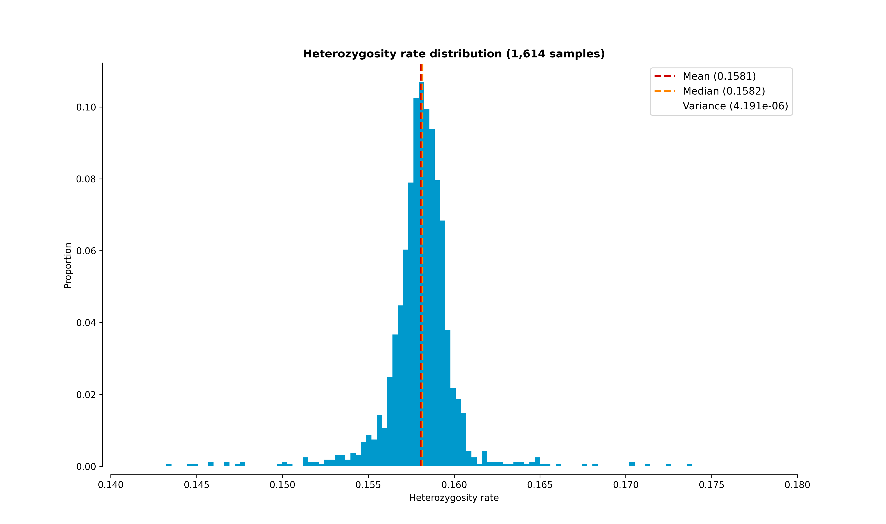
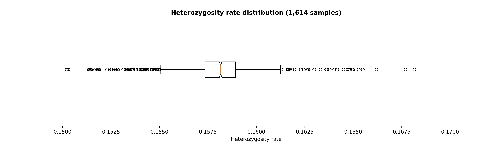

# No call / heterozygous

The _nocall_hetero_ QC module consists of two scripts: a [main](#main-script)
script and one to generate heterozygosity plots.

Use the following command to access the multiple scripts of the
_no_call_hetero_ QC module.

```shell-session
$ pyGenClean nocall-hetero --help
usage: pyGenClean nocall-hetero [-h] [-v] {run,heterozygosity-plot} ...

Clean markers with no call or heterozygous only.

options:
  -h, --help            show this help message and exit
  -v, --version         show program's version number and exit

subcommands:
  Below is a list of tools in the nocall-hetero module. Note that 'run'
  executes the main nocall-hetero pipeline.

  {run,heterozygosity-plot}
    run                 Clean markers with no call or heterozygous only.
    heterozygosity-plot
                        Computes heterozygosity rate and plots it.
```

## Main script

The main script (accessed using the `run` subcommand) reads the binary _Plink_
files to find markers which are either completely failed, or with a
heterozygosity rate of 100% (excluding the mitochondrial chromosome). Those
markers are then excluded from the dataset using _Plink_.

```shell-session
$ pyGenClean nocall-hetero run --help
usage: pyGenClean nocall-hetero run [-h] --bfile FILE [--plink-1.07]
                                    [--out FILE]

Clean markers with no call or heterozygous only.

options:
  -h, --help    show this help message and exit

Input File:
  --bfile FILE  The input file prefix (will find the binary files by appending
                the prefix to .bed, .bim and .fam, respectively).

Options:
  --plink-1.07  Use original Plink (version 1.07)

Output File:
  --out FILE    The prefix of the output files. [default: clean_noCall_hetero]
```

### Input Files

This module uses _Plink_'s binary file format (`bed`, `bim` and `fam` files) for
the source data set (the data of interest).

### Procedure

Here are the steps performed by the module:

1. Parse the binary _Plink_ files to find markers with 0% call rate, or markers
   with only heterozygous genotypes.
2. Use _Plink_ to exclude the markers found in step 1.

### Output files

Here is a comprehensive list of all the possible output files for each of the
steps described above.

!!! note
    The output prefix shown is the one by default (_i.e._
    `clean_noCall_hetero`).

`clean_noCall_hetero.{bed,bim,fam}`
: The new dataset which excludes the markers with no call (0% call rate) or with
  100% heterozygous genotypes (excluding the mitochondrial).

`clean_noCall_hetero.all_hetero`
: The list of markers which were all heterozygous in the original dataset
  (excluding the mitochondrial chromosome).

`clean_noCall_hetero.all_failed`
: The list of markers which were all failed in the original dataset.

`clean_noCall_hetero.exclude`
: The complete list of markers excluded from the original dataset (used by
  _Plink_).

## Submodules

The _nocall_hetero_ QC module also contains one submodule:
`heterozygosity-plot`.

### heterozygosity-plot

The `heterozygosity-plot` submodule computes the heterozygosity rate of each
sample and generates a plot.

```shell-session
$ pyGenClean nocall-hetero heterozygosity-plot --help
usage: pyGenClean nocall-hetero heterozygosity-plot [-h] [--bfile FILE]
                                                    [--het-file FILE]
                                                    [--boxplot]
                                                    [--format FORMAT]
                                                    [--bins INT]
                                                    [--xlim FLOAT FLOAT]
                                                    [--ymax FLOAT]
                                                    [--out FILE]

Computes heterozygosity rate and plots it.

options:
  -h, --help          show this help message and exit

Input File:
  --bfile FILE        The prefix of the transposed file
  --het-file FILE     The heterozygosity file created by this QC module.

Options:
  --boxplot           Draw a boxplot instead of a histogram.
  --format FORMAT     The output file format (png, ps, pdf, or X11 formats are
                      available). [default: png]
  --bins INT          The number of bins for the histogram. [default: 100]
  --xlim FLOAT FLOAT  The limit of the x axis (floats). The heterozygosity
                      valueswill be restricted around those two values
                      (inclusive).
  --ymax FLOAT        The maximal Y value.

Output File:
  --out FILE          The prefix of the output files. [default:
                      heterozygosity]
```

This submodule will produce either a [histogram](#hetero_histogram) or a
[boxplot](#hetero_boxplot) showing the distribution of the heterozygosity
values.

<figure markdown><a name="hetero_histogram"></a>
  { loading=lazy }
  <figcaption>Heterozygosity histogram.</figcaption>
</figure>

<figure markdown><a name="hetero_boxplot"></a>
  { loading=lazy }
  <figcaption>Heterozygosity boxplot.</figcaption>
</figure>
