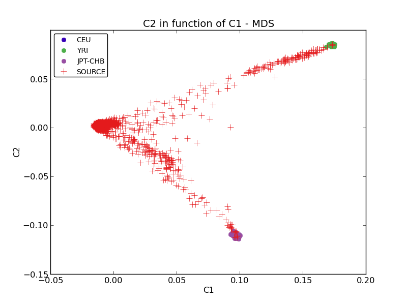
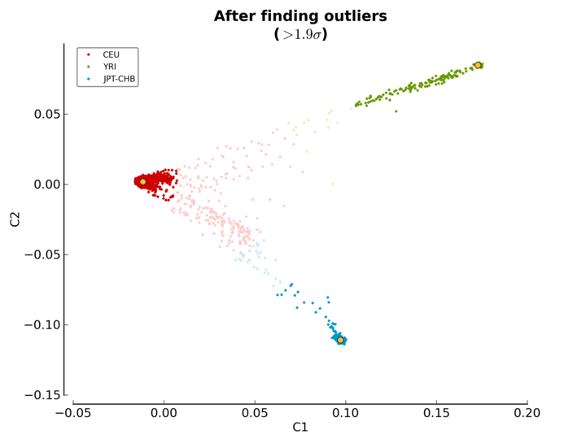

.. _ethnicity_module_label:

Ethnicity Module
================

The usage of the standalone module is shown below:

.. code-block:: console

    $ pyGenClean_check_ethnicity --help
    usage: pyGenClean_check_ethnicity [-h] --bfile FILE --ceu-bfile FILE
                                      --yri-bfile FILE --jpt-chb-bfile FILE
                                      [--min-nb-snp INT]
                                      [--indep-pairwise STR STR STR] [--maf FLOAT]
                                      [--sge] [--sge-walltime TIME]
                                      [--sge-nodes INT INT]
                                      [--ibs-sge-walltime TIME]
                                      [--ibs-sge-nodes INT INT]
                                      [--line-per-file-for-sge INT]
                                      [--nb-components INT] [--outliers-of POP]
                                      [--multiplier FLOAT] [--xaxis COMPONENT]
                                      [--yaxis COMPONENT] [--format FORMAT]
                                      [--title STRING] [--xlabel STRING]
                                      [--ylabel STRING] [--out FILE]
    
    Check samples' ethnicity using reference populations and IBS.
    
    optional arguments:
      -h, --help            show this help message and exit
    
    Input File:
      --bfile FILE          The input file prefix (will find the plink binary
                            files by appending the prefix to the .bim, .bed and
                            .fam files, respectively.
      --ceu-bfile FILE      The input file prefix (will find the plink binary
                            files by appending the prefix to the .bim, .bed and
                            .fam files, respectively.) for the CEU population
      --yri-bfile FILE      The input file prefix (will find the plink binary
                            files by appending the prefix to the .bim, .bed and
                            .fam files, respectively.) for the YRI population
      --jpt-chb-bfile FILE  The input file prefix (will find the plink binary
                            files by appending the prefix to the .bim, .bed and
                            .fam files, respectively.) for the JPT-CHB population
    
    Options:
      --min-nb-snp INT      The minimum number of markers needed to compute IBS
                            values. [Default: 8000]
      --indep-pairwise STR STR STR
                            Three numbers: window size, window shift and the r2
                            threshold. [default: ['50', '5', '0.1']]
      --maf FLOAT           Restrict to SNPs with MAF >= threshold. [default:
                            0.05]
      --sge                 Use SGE for parallelization.
      --sge-walltime TIME   The walltime for the job to run on the cluster. Do not
                            use if you are not required to specify a walltime for
                            your jobs on your cluster (e.g. 'qsub
                            -lwalltime=1:0:0' on the cluster).
      --sge-nodes INT INT   The number of nodes and the number of processor per
                            nodes to use (e.g. 'qsub -lnodes=X:ppn=Y' on the
                            cluster, where X is the number of nodes and Y is the
                            number of processor to use. Do not use if you are not
                            required to specify the number of nodes for your jobs
                            on the cluster.
      --ibs-sge-walltime TIME
                            The walltime for the IBS jobs to run on the cluster.
                            Do not use if you are not required to specify a
                            walltime for your jobs on your cluster (e.g. 'qsub
                            -lwalltime=1:0:0' on the cluster).
      --ibs-sge-nodes INT INT
                            The number of nodes and the number of processor per
                            nodes to use for the IBS jobs (e.g. 'qsub
                            -lnodes=X:ppn=Y' on the cluster, where X is the number
                            of nodes and Y is the number of processor to use. Do
                            not use if you are not required to specify the number
                            of nodes for your jobs on the cluster.
      --line-per-file-for-sge INT
                            The number of line per file for SGE task array for the
                            IBS jobs. [default: 100]
      --nb-components INT   The number of component to compute. [default: 10]
    
    Outlier Options:
      --outliers-of POP     Finds the outliers of this population. [default: CEU]
      --multiplier FLOAT    To find the outliers, we look for more than x times
                            the cluster standard deviation. [default: 1.9]
      --xaxis COMPONENT     The component to use for the X axis. [default: C1]
      --yaxis COMPONENT     The component to use for the Y axis. [default: C2]
    
    MDS Plot Options:
      --format FORMAT       The output file format (png, ps, pdf, or X11 formats
                            are available). [default: png]
      --title STRING        The title of the MDS plot. [default: C2 in function of
                            C1 - MDS]
      --xlabel STRING       The label of the X axis. [default: C1]
      --ylabel STRING       The label of the Y axis. [default: C2]
    
    Output File:
      --out FILE            The prefix of the output files. [default: ethnicity]

Input Files
-----------

This module uses PLINK's binary file format (``bed``, ``bim`` and ``fam`` files)
for the source data set (the data of interest) and three sets of binary files
for the reference panels (CEU, YRI and JPG-CHB).

Procedure
---------

Here are the steps performed by the module:

1.  Finds the overlapping markers between the three reference panels and the
    source panel.
2.  Extracts the required markers from all the data sets (source and reference
    panels).
3.  Combines the three reference panels together to create a single data set.
4.  Renames the reference panel's markers so that they match the names of the
    markers in the source panel.
5.  Computes the frequency of all the markers from the reference and the source
    panels.
6.  Finds the markers to flip in the reference panel, to enable fast comparison
    with the source panel.
7.  Excludes markers that cannot be flip from the reference and the source
    panels.
8.  Flips the markers that need to be in the reference panel.
9.  Combines the reference and the source panels.
10. Computes the IBS values (see Section :ref:`related_samples_label` for more
    information).
11. Creates the MDS file from the combined data set and the IBS values.
12. Creates a population file for plotting purposes.
13. Plots the MDS values.
14. Finds the outliers of a given reference population (either CEU, YRI or
    JPT-CHB).

    i.   Reads the population file.
    ii.  Reads the MDS values.
    iii. Computes the three reference population clusters' center.
    iv.  Computes three clusters according to the reference population clusters'
         centers, and finds the outliers of a given reference population.
    v.   Writes the outliers in a file.

Output Files
------------

The output files of each of the steps described above are as follow (note that
the output prefix shown is the one by default [*i.e* ``ethnicity``]):

1.  Three files are created:

    *   ``ethnicity.ref_snp_to_extract``: a list of markers to extract from the
        reference panels.
    *   ``ethnicity.source_snp_to_extract``: a list of markers to extract from
        the source panel.
    *   ``ethnicity.update_names``: the updated names of the marker in the
        reference panels, so that they match with the names in the source panel.

2.  Four sets of PLINK's binary files are created:

    *   ``ethnicity.reference_panel.CEU``: the data set containing the extracted
        markers from the CEU reference population.
    *   ``ethnicity.reference_panel.YRI``: the data set containing the extracted
        markers from the YRI reference population.
    *   ``ethnicity.reference_panel.JPT-CHB``: the data set containing the
        extracted markers from the JPG-CHB reference population.
    *   ``ethnicity.source_panel.ALL``: the data set containing the extracted
        markers from the source population.

3.  One required file and one set of PLINK's binary files are created:

    *   ``ethnicity.reference_panel.ALL.files_to_merge``: the file required by
        Plink to merge more than two data sets together.
    *   ``ethnicity.reference_panel.ALL``: the data set containing the merged
        data sets of the three reference population.

4.  One set of PLINK's binary files is created:

    *   ``ethnicity.reference_panel.ALL.rename``: the data set after markers
        have been renamed in the reference panels.

5.  Two sets of PLINK's result files are created:

    *   ``ethnicity.reference_panel.ALL.rename.frequency``: the frequencies of
        the markers in the reference panels.
    *   ``ethnicity.source_panel.ALL.frequency``: the frequencies of the markers
        in the source panels.

6.  Two files are created:

    *   ``ethnicity.snp_to_flip_in_reference``: the list of markers to flip in
        the reference panels.
    *   ``ethnicity.snp_to_remove``: the list of markers to remove because they
        are not comparable to the markers in the source panel, even after trying
        to flip them.

7.  Two sets of PLINK's binary files are created:

    *   ``ethnicity.reference_panel.ALL.rename.cleaned``: the data set after the
        markers found in the previous step are excluded from the reference panels.
    *   ``ethnicity.source_panel.ALL.cleaned``: the data set after the markers
        found in the previous step are excluded from the source panel.

8.  One set of PLINK's binary files is created:

    *   ``ethnicity.reference_panel.ALL.rename.cleaned.flipped``: the data set
        after markers from the reference panels were flipped so that they become
        comparable with the source panel.

9.  One required file and one set of PLINK's binary files are created:

    *   ``ethnicity.final_dataset_for_genome.files_to_merge``: the file required
        by Plink to merge more than two data sets together.
    *   ``ethnicity.final_dataset_for_genome``: the data set containing the
        merged reference and source panels.

10. Multiple files are created after this step.

    *   ``ethnicity.ibs`` : for more information about those files, see Section
        :ref:`related_samples_label`.

11. One set of PLINK's result files is created:

    *   ``ethnicity.mds``: files containing the MDS values.

12. One file is created:

    *   ``ethnicity.population_file``: the population file required for MDS
        value plotting.

13. One file is created:

    *   ``ethnicity.mds.png``: the plot of the MDS values (see Figure
        :ref:`mds_plot_figure`).

14. Four files are created:

    *   ``ethnicity.before.png``: the MDS values before outliers detection (see
        Figure :ref:`mds_plot_before_figure`).
    *   ``ethnicity.after.png``: the MDS values after outliers detection for
        each of the three reference populations. The shaded points are the
        outliers (see Figure :ref:`mds_plot_after_figure`).
    *   ``ethnicity.outliers.png``: the MDS values after outliers detection for
        the selected reference population (default is CEU) (see Figure
        :ref:`ethnicity_outliers_figure`).
    *   ``ethnicity.outliers``: the list of outliers (excluding the reference
        populations).
    *   ``ethnicity.population_file_outliers``: a population file containing the
        outliers (to help creating a new MDS plot using
        :py:mod:`PlinkUtils.plot_MDS_standalone`).

.. _ethnicity_plots_label:

The Plots
---------

Multiple plots are created by this module. The first one (Figure
:ref:`mds_plot_figure`) is the MDS values right after they are computed by
Plink. There is one color per reference populations (CEU in blue, YRI in green
and JPT-CHB in purple). The source population is represented as red crosses.

.. _mds_plot_figure:

    Initial MDS plot

The second one (Figure :ref:`mds_plot_before_figure`) is the MDS values before
outlier detection. Points in red, green and blue represent the individuals part
of the CEU, YRI and JPT-CHB clusters, respectively. The yellow points represent
the center of each of the cluster, when only considering the three reference
panels.

.. _mds_plot_before_figure:

.. figure:: _static/images/check_ethnicity/ethnicity_before.png
    :align: center
    :width: 100%
    :alt: MDS plot before

    MDS plot before outlier detection

The third plot (Figure :ref:`mds_plot_after_figure`) is the MDS values after
outlier detection. Points in red, green and blue represent the individuals part
of the CEU, YRI and JPT-CHB clusters, respectively. Outliers are found for each
of the three reference populations and they are represented with the same, but
lighter color. Once again, the yellow points represent the center of each of the
cluster, when only considering the three reference panels.

.. _mds_plot_after_figure:

    MDS plot after outlier detection

The last plot (Figure :ref:`ethnicity_outliers_figure`) shows the outliers of
the selected reference population (CEU by default). Red, green and blue
represent the CEU, YRI and JPT-CHB samples, respectively. Orange represents the
individuals from the source panel who are part of the selected reference
population. Gray represents the outliers of the selected reference population.

.. _ethnicity_outliers_figure:

.. figure:: _static/images/check_ethnicity/ethnicity_outliers.png
    :align: center
    :width: 100%
    :alt: Ethnic outliers

    Ethnic outliers

Modifying The Outlier Plot
..........................

If you want to manually modify the above figures, have a look at the
:py:mod:`PlinkUtils.plot_MDS_standalone` module. Here is the usage of this
script:

.. code-block:: console

    $ pyGenClean_plot_MDS --help
    usage: pyGenClean_plot_MDS [-h] --file FILE --population-file FORMAT
                               [--population-order STRING]
                               [--population-colors STRING]
                               [--population-sizes STRING]
                               [--population-markers STRING]
                               [--population-alpha STRING] [--format FORMAT]
                               [--title STRING] [--xaxis STRING] [--xlabel STRING]
                               [--yaxis STRING] [--ylabel STRING]
                               [--legend-position STRING] [--legend-size INT]
                               [--legend-ncol INT] [--legend-alpha FLOAT]
                               [--title-fontsize INT] [--label-fontsize INT]
                               [--axis-fontsize INT] [--adjust-left FLOAT]
                               [--adjust-right FLOAT] [--adjust-top FLOAT]
                               [--adjust-bottom FLOAT] [--out FILE]

    Creates a MDS plot

    optional arguments:
      -h, --help            show this help message and exit

    Input File:
      --file FILE           The MBS file.
      --population-file FORMAT
                            A file containing population information. There must
                            be three columns: famID, indID and population
                            information.

    Population Properties:
      --population-order STRING
                            The order to print the different populations.
                            [default: CEU,YRI,JPT-CHB,SOURCE,OUTLIER]
      --population-colors STRING
                            The population point color in the plot [default:
                            377eb8,4daf4a,984ea3,e41a1c,ff7f00]
      --population-sizes STRING
                            The population point size in the plot. [default:
                            12,12,12,8,3]
      --population-markers STRING
                            The population point marker in the plot. [default:
                            .,.,.,+,D]
      --population-alpha STRING
                            The population alpha value in the plot. [default:
                            1.0,1.0,1.0,1.0,1.0]

    Graphical Properties:
      --format FORMAT       The output file format (png, ps, pdf, or X11 formats
                            are available). [default: png]
      --title STRING        The title of the MDS plot. [default: C2 in function of
                            C1 - MDS]
      --xaxis STRING        The component to print on the X axis. [default: C1]
      --xlabel STRING       The label of the X axis. [default: C1]
      --yaxis STRING        The component to print on the Y axis. [default: C2]
      --ylabel STRING       The label of the Y axis. [default: C2]
      --legend-position STRING
                            The position of the legend. [default: best]
      --legend-size INT     The size of the legend. [default: 10]
      --legend-ncol INT     The number of column for the legend. [default: 1]
      --legend-alpha FLOAT  The alpha value of the legend frame. [default: 1.0]
      --title-fontsize INT  The font size of the title. [default: 15]
      --label-fontsize INT  The font size of the X and Y labels. [default: 12]
      --axis-fontsize INT   The font size of the X and Y axis. [Default: 12]
      --adjust-left FLOAT   Adjust the left margin. [Default: 0.12]
      --adjust-right FLOAT  Adjust the right margin. [Default: 0.90]
      --adjust-top FLOAT    Adjust the top margin. [Default: 0.90]
      --adjust-bottom FLOAT
                            Adjust the bottom margin. [Default: 0.10]

    Output File:
      --out FILE            The prefix of the output files. [default: mds]

And here is an example of usage (for a MDS and a population file named
``ethnicity.mds.mds`` and ``ethnicity.population_file_outliers``, respectively),
producing the Figure :ref:`ethnicity_outliers_modified_figure`.

.. code-block:: console

    $ pyGenClean_plot_MDS \
    >     --file ethnicity.mds.mds \
    >     --population-file ethnicity.population_file_outliers \
    >     --population-order SOURCE,CEU,YRI,JPT-CHB,OUTLIER \
    >     --population-colors e41a1c,377eb8,4daf4a,984ea3,000000 \
    >     --population-markers .,.,.,.,+ \
    >     --population-sizes 8,8,8,8,8 \
    >     --axis-fontsize 18 \
    >     --label-fontsize 18 \
    >     --title-fontsize 24 \
    >     --adjust-bottom 0.11 \
    >     --adjust-left 0.15 \
    >     --adjust-right 0.96 \
    >     --legend-size 14 \
    >     --legend-position lower-right    

.. _ethnicity_outliers_modified_figure:

.. figure:: _static/images/check_ethnicity/ethnicity_outliers_modified.png
    :align: center
    :width: 100%
    :alt: Ethnic outliers modified

    Ethnic outliers modified

.. _ethnicity_find_outliers:

Finding Outliers
----------------

If the multiplier of the cluster standard deviation was too stringent (or not
stringent enough), there is no need to run the module from the start. A
standalone script was created for this exact purpose, and it will find the
outliers using the ``MDS`` and population file previously created. Just modify
the ``--multiplier`` option and restart the analysis (which takes about a couple
of seconds).

.. code-block:: console

    $ pyGenClean_find_outliers --help
    usage: pyGenClean_find_outliers [-h] --mds FILE --population-file FILE
                                    [--outliers-of POP] [--multiplier FLOAT]
                                    [--xaxis COMPONENT] [--yaxis COMPONENT]
                                    [--format FORMAT] [--out FILE]

    Finds outliers in SOURCE from CEU samples.

    optional arguments:
      -h, --help            show this help message and exit

    Input File:
      --mds FILE            The MDS file from Plink
      --population-file FILE
                            A population file containing the following columns
                            (without a header): FID, IID and POP. POP should be
                            one of 'CEU', 'JPT-CHB', 'YRI' and SOURCE.

    Options:
      --outliers-of POP     Finds the outliers of this population. [default: CEU]
      --multiplier FLOAT    To find the outliers, we look for more than x times
                            the cluster standard deviation. [default: 1.9]
      --xaxis COMPONENT     The component to use for the X axis. [default: C1]
      --yaxis COMPONENT     The component to use for the Y axis. [default: C2]
      --format FORMAT       The output file format (png, ps, or pdf formats are
                            available). [default: png]

    Output File:
      --out FILE            The prefix of the output files. [default: ethnicity]

The Algorithm
--------------

For more information about the actual algorithms and source codes (the
:py:mod:`Ethnicity.check_ethnicity`, the :py:mod:`Ethnicity.find_outliers` and
the :mod:`PlinkUtils.plot_MDS_standalone` modules), refer to the following
sections.

Ethnicity.check_ethnicity
.........................

.. automodule:: Ethnicity.check_ethnicity
    :members:

Ethnicity.find_outliers
.......................

.. automodule:: Ethnicity.find_outliers
    :members:

PlinkUtils.plot_MDS_standalone
..............................

.. automodule:: PlinkUtils.plot_MDS_standalone
    :members:
