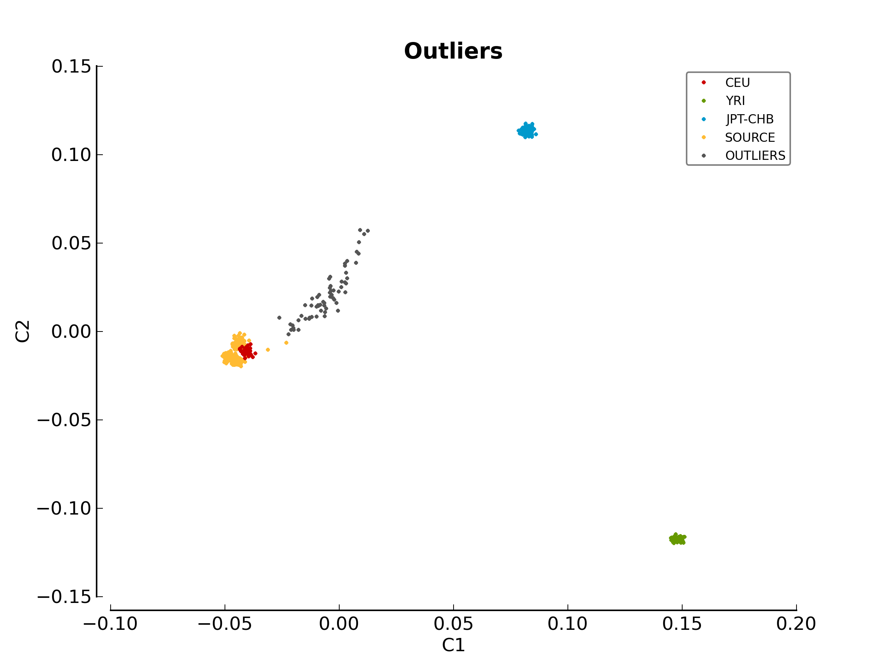

Linux Installation
==================

The following steps will help you install *pyGenClean* on a Linux machine. It
has been fully tested on 64 bits machine, but should work without issue on a 32
bits machine.

Prerequisites
--------------

The following softwares and packages are required for *pyGenClean*:

1.  Python 2.7
2.  NumPy (:math:`\geq` 1.6.2)
3.  matplotlib (:math:`\geq` 1.2.0)
4.  scipy (:math:`\geq` 0.11.0)
5.  scikit-learn (:math:`\geq` 0.12.1)
6.  drmaa (:math:`\geq` 0.5)
7.  PLINK (1.07)

Installation
------------

Before installing any of those packages, you need to be sure that the
development tools are installed on your machine. For example, for Fedora or
CentOS installations:

.. code-block:: console

    $ sudo yum groupinstall "Development Tools"
    $ sudo yum install zlib-devel

For a ubuntu installation:

.. code-block:: console
   
    $ sudo apt-get install build-essential libz-dev

.. note::

    For all of the installation bellow, if the compilation completes without any
    error, everything should be fine. Note that on some platform (32 versus 64
    bits), some test units might fail (scipy [double precision] and
    scikit-learn). Since not all of the functions provided by these modules are
    used, and that those that are used were tested, everything should run
    smoothly.

Python
......

Every Linux distributions comes with Python installed. However, this
pre-installed Python can be obsolete. *pyGenClean* requires Python 2.7. To check
the Python version, open a terminal and type the following command:

.. code-block:: console

    $ python -c "import platform; print(platform.python_version())"

.. note::

    **If the version is 2.7.x**, be sure to install the development package. To
    do so, on Fedora or CentOS installation:

    .. code-block:: console

        $ sudo yum install python-devel

    And on ubuntu installation:

    .. code-block:: console

        $ sudo apt-get install python-dev

    You can then skip to the following section, the installation of a
    :ref:`python_virtual_environment_label`.

**If the version is lower** than 2.7, or **if the version is 3.x**, you will
need to install your own version of Python. To install your own version of
Python, download the source code on the download page:
`http://python.org/download/ <http://python.org/download/>`_ by selecting the
bzipped source tarball. At the moment of writing this documentation, the latest
version was 2.7.3.

Locate the downloaded archive file (usually in the ``~/Downloads`` directory,
and performed the following command, in the terminal:

.. code-block:: console

    $ cd ~/Downloads
    $ tar -jxf Python-2.7.3.tar.bz2
    $ cd Python-2.7.3

Be sure that every conditions are met by reading the ``README`` file. Create a
directory where Python will be install, and configure the installation
accordingly:

.. code-block:: console

    $ mkdir -p ~/softwares/Python-2.7
    $ ./configure --prefix=$HOME/softwares/Python-2.7

Once the configuration has been made, build Python:

.. code-block:: console

    $ make

After compilation, check if there are missing development packages. They will be
enumerated after this line: ``Python build finished, but the necessary bits to
build these modules were not found``. Install the missing packages.

Once everything is build, check and install Python:

.. code-block:: console

    $ make test
    $ make install

To test the new installation of Python, type the following command in the
terminal:

.. code-block:: console

    $ ~/softwares/Python-2.7/bin/python
    Python 2.7.3 (default, Feb 16 2013, 12:23:41) 
    [GCC 4.7.2 20121109 (Red Hat 4.7.2-8)] on linux2
    Type "help", "copyright", "credits" or "license" for more information.
    >>>

Type ``exit()`` to close the Python interpreter.

.. _python_virtual_environment_label:

Python Virtual Environment
..........................

We recommend installing *pyGenClean* in a virtual environment. To do so,
download the latest version of ``virtualenv``, located at this web page:
`http://pypi.python.org/pypi/virtualenv
<http://pypi.python.org/pypi/virtualenv>`_. At the moment of writing this
documentation, the latest version was 1.8.4, and the file was named
``virtualenv-1.8.4.tar.gz``. Locate the archive, which is usually in the
``~/Downloads`` directory.

.. code-block:: console

    $ cd ~/Downloads
    $ tar -zxf virtualenv-1.8.4.tar.gz
    $ cd virtualenv-1.8.4

There is no need to install the module. Just create a directory to create the
Python virtual environment:

.. code-block:: console

    $ mkdir -p ~/softwares/Python-2.7_virtualenv

If you have installed a new version on Python (that should be installed in
``~/softwares/Python-2.7``, perform the following command to install the
virtual environment:

.. code-block:: console

    $ ~/softwares/Python-2.7/bin/python ./virtualenv.py \
    >     --no-site-packages \
    >     ~/softwares/Python-2.7_virtualenv

.. note::
   
    **If you already had a Python 2.7 installation**, perform the following
    command to install the virtual environment:

    .. code-block:: console

        $ python ./virtualenv.py \
        >     --no-site-packages \
        >     ~/softwares/Python-2.7_virtualenv

Locate the ``bin`` directory of the Python virtual environment, and be certain
that there is a file called ``python2.7``.

.. code-block:: console

    $ cd ~/softwares/Python-2.7_virtualenv/bin
    $ ls python2.7

If there are no ``python2.7`` file, create it using this command:

.. code-block:: console

    $ ln -s python python2.7

To activate the Python virtual environment, perform the following command:

.. code-block::  console

    $ source ~/softwares/Python-2.7_virtualenv/bin/activate

Finally, to deactivate the Python virtual environment, either close the
terminal, or perform the following command:

.. code-block:: console

    $ deactivate

.. warning::

    For the following installations and tests, be certain that the Python
    virtual environment is activated, or nothing will work as planned...

    The best way to know if the Python virtual environment is activated, is to
    see its name, in parenthesis, before the usual prompt in the terminal. For
    example:

    .. code-block:: none

        (Python-2.7_virtualenv)[username@localhost ~]$

NumPy
.....

Before installing NumPy, be certain that the previously installed Python virtual
environment is activated (see the :ref:`python_virtual_environment_label`
installation for more information).

.. note::
   
    Be certain that ``lapack``, ``atlas`` and ``blas`` development packages are
    installed. For Fedora or CentOS installation, perform the following command:

    .. code-block:: console

        $ sudo yum install lapack-devel blas-devel atlas-devel

    For ubuntu installation:

    .. code-block:: console

        $ sudo apt-get install gfortran liblapack-dev libblas-dev libatlas-dev

Go to the NumPy download site (`http://sourceforge.net/projects/numpy/files/
<http://sourceforge.net/projects/numpy/files/>`_) and download the latest
version. At the moment of writing this documentation, the latest version was
1.7.0 and the file was named ``numpy-1.7.0.tar.gz``. Do not install any beta
with a ``b`` in the file name) or release candidate (with a ``rc`` in the file
name) version.

Locate the downloaded archive (it should be in the ``~/Downloads`` directory).
Perform the following commands:

.. code-block:: console

    $ cd ~/Downloads
    $ tar -zxf numpy-1.7.0.tar.gz
    $ cd numpy-1.7.0

Check NumPy dependencies by performing the following command:

.. code-block:: console

    $ python2.7 setup.py config

Build and install NumPy using these two commands:

.. code-block:: console

    $ python2.7 setup.py build
    $ python2.7 setup.py install

If you want to test the NumPy installation, perform the following commands:

.. code-block:: console

    $ cd
    $ pip install -U nose
    $ python2.7 -c "import numpy; numpy.test()"

matplotlib
..........

Before installing matplotlib, be certain that the previously installed Python
virtual environment is activated (see :ref:`python_virtual_environment_label`
installation for more information).

.. note::
   
    Be certain that ``freetype`` and ``libpng`` development packages are
    installed. For Fedora or CentOS installation, perform the following command:

    .. code-block:: console

        $ sudo yum install freetype-devel libpng-devel

    For ubuntu installation:

    .. code-block:: console

        $ sudo apt-get install libfreetype6-dev libpng-dev

Go to the matplotlib download site (`http://matplotlib.org/downloads.html
<http://matplotlib.org/downloads.html>`_) and download the latest version. At
the moment of writing this documentation, the latest version was 1.2.0 and the
file was named ``matplotlib-1.2.0.tar.gz``. Do not install any beta (with a
``b`` in the file name) or release candidate (with a ``rc`` in the file name)
version.

Locate the downloaded archive (it should be in the ``~/Downloads`` directory).
Perform the following commands:

.. code-block:: console

    $ cd ~/Downloads
    $ tar -zxf matplotlib-1.2.0.tar.gz
    $ cd matplotlib-1.2.0

Check matplotlib dependencies by performing the following command:

.. code-block:: console

    $ python2.7 setup.py config

Build and install matplotlib using these two commands:

.. code-block:: console

    $ python2.7 setup.py build
    $ python2.7 setup.py install

If you want to test the matplotlib installation, perform the following commands:

.. code-block:: console

    $ mkdir test_matplotlib
    $ cd test_matplotlib
    $ pip install -U nose
    $ python2.7 -c "import matplotlib; matplotlib.test()"

scipy
.....

Before installing scipy, be certain that the previously installed Python virtual
environment is activated (see :ref:`python_virtual_environment_label`
installation for more information).

Go to the scipy download site (`http://sourceforge.net/projects/scipy/files/
<http://sourceforge.net/projects/scipy/files/>`_) and download the latest
version. At the moment of writing this documentation, the latest version was
0.11.0 and the file was named ``scipy-0.11.0.tar.gz``. Do not install any beta
(with a ``b`` in the file name) or release candidate (with a ``rc`` in the file
name) version.

Locate the downloaded archive (it should be in the ``~/Downloads`` directory).
Perform the following commands:

.. code-block:: console

    $ cd ~/Downloads
    $ tar -zxf scipy-0.11.0.tar.gz
    $ cd scipy-0.11.0

Check scipy dependencies by performing the following command:

.. code-block:: console

    $ python2.7 setup.py config

Build and install scipy using these two commands:

.. code-block:: console

    $ python2.7 setup.py build
    $ python2.7 setup.py install

If you want to test the scipy installation, perform the following commands:

.. code-block:: console

    $ cd
    $ pip install -U nose
    $ python2.7 -c "import scipy; scipy.test()"

.. warning::

    For reasons unknown (and out of our control), scipy failed a lot of unit
    tests on our installation of CentOS 6.3 (64 bits). If this is your case, and
    since scikit-learn uses scipy, you might want to double check the outliers
    detection in the :ref:`ethnicity_module_label`. See below for more
    information (section :ref:`testing_label`). We checked the results from the
    CentOS installation, and they were as expected.

    If you're unsure of the outlier list, you can use another approach to find
    them using the MDS file that is generated by the
    :ref:`ethnicity_module_label`.

scikit-learn
............

Before installing scikit-learn, be certain that the previously installed Python
virtual environment is activated (see :ref:`python_virtual_environment_label`
installation for more information).

Go to the scikit-learn download site
(`http://sourceforge.net/projects/scikit-learn/files/
<http://sourceforge.net/projects/scikit-learn/files/>`_) and download the latest
version. At the moment of writing this documentation, the latest version was
0.13 and the file was named ``scikit-learn-0.13.tar.gz``. Do not install any
beta (with a ``b`` in the file name) or release candidate (with a ``rc`` in the
file name) version.

Locate the downloaded archive (it should be in the ``~/Downloads`` directory).
Perform the following commands:

.. code-block:: console

    $ cd ~/Downloads
    $ tar -zxf scikit-learn-0.13.tar.gz
    $ cd scikit-learn-0.13

Check scikit-learn dependencies by performing the following command:

.. code-block:: console

    $ python2.7 setup.py config

Build and install scikit-learn using these two commands:

.. code-block:: console

    $ python2.7 setup.py build
    $ python2.7 setup.py install

If you want to test the scikit-learn installation, perform the following
commands:

.. code-block:: console

    $ cd
    $ pip install -U nose
    $ python2.7 -c "import sklearn; sklearn.test()"

Don't worry if some tests fail. The required functions will be tested later with
*pyGenClean*.

drmaa
.....

This module is optional (only if you want to use *pyGenClean* on a server with a
DRMAA-compliant distributed resource management system).

Before installing drmaa, be certain that the previously installed Python virtual
environment is activated (see :ref:`python_virtual_environment_label`
installation for more information). To install the latest version of drmaa,
perform the following command:

.. code-block:: console

    $ pip install drmaa

In order to use the drmaa module, a specific environment variable needs to be
set. To check if the variable is set, simply execute the following command:

.. code-block:: console

    $ echo $DRMAA_LIBRARY_PATH

If nothing is displayed on the screen, you need to locate the file
``libdrmaa.so`` and set the variable to link to this path. To do so, add this
line to the ``~/.bash_profile`` file (you will need to log out, so that the
change takes effect):

.. code-block:: bash
    :linenos:

    export DRMAA_LIBRARY_PATH='/PATH/TO/THE/libdrmaa.so'

PLINK
.....

If PLINK is not already install, go to the download page
(`http://pngu.mgh.harvard.edu/~purcell/plink/download.shtml
<http://pngu.mgh.harvard.edu/~purcell/plink/download.shtml>`_), and download the
1.07 version for your Linux distribution (either x86_64 or i686). To find you
distribution type, perform the following command:

.. code-block:: console

    $ uname -m

Locate the downloaded archive (it should be in the ``~/Downloads`` directory).
Perform the following commands:

.. code-block:: console

    $ cd ~/Downloads
    $ unzip plink-1.07*.zip
    $ cd plink-1.07*/
    $ mkdir -p ~/bin
    $ cp plink ~/bin

Be sure that your newly created ``bin`` directory is in your ``PATH``. To do so,
perform the following command:

.. code-block:: console

    $ echo $PATH

If you see ``/home/username/bin`` in the path (where ``username`` is your user
name), than you are good to go. If not, add the following two lines to you
``~/.bash_profile`` file (you will need to log out, so that the change takes
effect):

.. code-block:: bash
    :linenos:

    PATH=$HOME/bin:$PATH
    export PATH

To test the PLINK installation, perform the following commands and you should
see the following results:

.. code-block:: console

    $ cd
    $ plink --noweb
    @----------------------------------------------------------@
    |        PLINK!       |     v1.07      |   10/Aug/2009     |
    |----------------------------------------------------------|
    |  (C) 2009 Shaun Purcell, GNU General Public License, v2  |
    |----------------------------------------------------------|
    |  For documentation, citation & bug-report instructions:  |
    |        http://pngu.mgh.harvard.edu/purcell/plink/        |
    @----------------------------------------------------------@

    Skipping web check... [ --noweb ] 
    Writing this text to log file [ plink.log ]
    Analysis started: Sat Feb 16 14:20:09 2013

    Options in effect:
    	--noweb

    Before frequency and genotyping pruning, there are 0 SNPs
    0 founders and 0 non-founders found
    0 SNPs failed missingness test ( GENO > 1 )
    0 SNPs failed frequency test ( MAF < 0 )
    After frequency and genotyping pruning, there are 0 SNPs

    ERROR: Stopping as there are no SNPs left for analysis

pyGenClean
..........

To install pyGenClean, download the latest version on the download site
(`http://statgen.org/downloads/ <http://statgen.org/downloads/>`_). At the
moment of writing this documentation, the latest version was 1.3, and the name
of the file is ``pyGenClean-1.3.tar.gz``.

Locate the downloaded archive (it should be in the ``~/Downloads`` directory).
Perform the following commands:

.. code-block:: console

    $ cd ~/Downloads
    $ tar -zxf pyGenClean-1.3.tar.gz
    $ cd pyGenClean-1.3

Build and install *pyGenClean* using these two commands:

.. code-block:: console

    $ python2.7 setup.py build
    $ python2.7 setup.py install

.. _testing_label:

Testing the Algorithm
---------------------

.. warning::

    Before using *pyGenClean*, be certain that the previously installed Python
    virtual environment is activated (see
    :ref:`python_virtual_environment_label` installation for more information).
    If note, noting will work...

To test the algorithm, download the test data from `http://www.statgen.org
<http://www.statgen.org>`_ and the HapMap reference populations (build 37).

Locate the downloaded archives (it should be in the ``~/Downloads`` directory).
Perform the following commands:

.. code-block:: console

    $ cd ~/Downloads
    $ mkdir -p ~/test_pyGenClean
    $ tar -C ~/test_pyGenClean -jxf check_ethnicity_HapMap_reference_populations_b37.tar.bz2
    $ tar -C ~/test_pyGenClean -jxf pyGenClean_test_data.tar.bz2
    $ cd ~/test_pyGenClean

Create a text file named ``conf.txt`` inside the ``~/test_pyGenClean``
directory, containing the following text:

.. code-block:: lighttpd
    :linenos:

    [1]
    script = check_ethnicity
    ceu-bfile = check_ethnicity_HapMap_ref_pops_b37/hapmap_CEU_r23a_filtered_b37
    yri-bfile = check_ethnicity_HapMap_ref_pops_b37/hapmap_YRI_r23a_filtered_b37
    jpt-chb-bfile = check_ethnicity_HapMap_ref_pops_b37/hapmap_JPT_CHB_r23a_filtered_b37
    nb-components = 2
    multiplier = 1

    [2]
    script = sex_check

Run the following command:

.. code-block:: console

    $ run_pyGenClean \
    >     --conf conf.txt \
    >     --bfile pyGenClean_test_data/1000G_EUR-MXL_Human610-Quad-v1_H

Valuable information will be shown in the terminal. Once the program has
finished, the results are in the new directory ``data_clean_up.date_time`` where
``date`` is the current date, and ``time`` is the time when the program started.

Here are the new directory structure, with only the files you might be
interested in:

*   ``data_clean_up.data_time/``

    *   ``1_check_ethnicity/``

        *   ``ethnicity.before.png``
        *   ``ethnicity.outliers.png``
        *   ``ethnicity.outliers``
        *   ``ethnicity.population_file_outliers``

    *   ``2_sex_check/``

        *   ``sexcheck.list_problem_sex``

The first image in the first directory (:ref:`test_ethnicity_before_linux_figure`)
shows the MDS values for each sample before outlier detection. The second image
(:ref:`test_ethnicity_outliers_linux_figure`) shows the outliers that should be
removed for further analysis. Finally, the file ``ethnicity.outliers`` include a
list of samples that should be removed for further analysis. **The total number
of outliers for this test should be exactly 62**, but the figures might be
mirrored for 32 bits systems. For more information about the results of this
module, refer to Section :ref:`ethnicity_module_label`.

.. _test_ethnicity_before_linux_figure:

.. figure:: _static/images/installation/ethnicity_before_linux.png
    :align: center
    :width: 50%
    :alt: Ethnic Before Outliers

    ethnicity.before.png

.. _test_ethnicity_outliers_linux_figure:

    ethnicity.outliers.png

In the second directory, there should be a file containing the list of samples
with gender problem. **There should be exactly 4 samples with gender problem.**
For more information about this module, refer to Section
:ref:`sexcheck_module_lable`.

If you want to compare your results with the expected ones, just download the
files in the archive ``pyGenClean_expected_results.tar.bz2``, available through
`http://www.statgen.org <http://www.statgen.org>`_. They were generated using
Fedora 18 (64 bits) in about 20 minutes. You should at least compare the
following files:

*   ``1_check_ethnicity``

    *   ``ethnicity.outliers``
    *   ``ethnicity.population_file_outliers``
    *   All the figures (they might be mirrored).

*   ``2_sex_check``

    *   ``sexcheck.list_problem_sex``
    *   ``sexcheck.list_problem_sex_ids``
